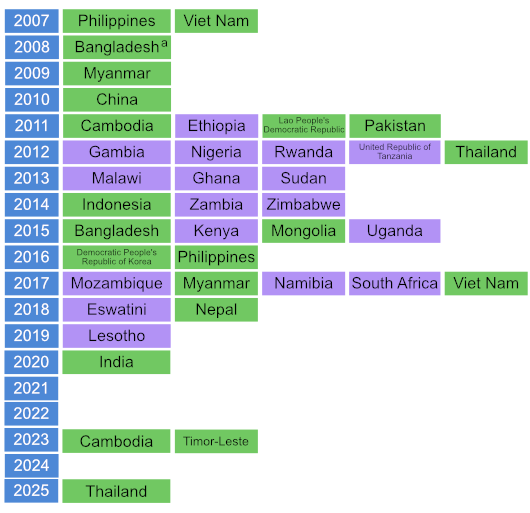

--- 
title: "Section 1.4 TB prevalence surveys " 
author: "Irwin Law, with some tweaks by Hazim Timimi and Taku Yamanaka" 
date: "`r Sys.Date()`" 
time: "`r Sys.time()`"
knit: (function(inputFile, encoding) {
      out_dir <- "./local";
      rmarkdown::render(inputFile,
                        encoding=encoding,
                        output_dir=file.path(dirname(inputFile), out_dir))})
output:  
  html_fragment:
    # Do not include a table of contents
    toc: no
    # Set standard figure width to 12 inches
    fig_width: 12
    # Do not write figure captions
    fig_caption: FALSE
    # Don't embed external resources (stylesheets, JS libraries) in the output 
    self_contained: FALSE
    # Don't include <div> tags around a header and the content found until the next header
    section_divs: FALSE  

# Run this line below to output as Word but figures are not supported for docx output.
#output: word_document

# To run this file and store output as html:
# rmarkdown::render(here::here("report/ch1-4.rmd"), output_file = "ch1-4.html", output_dir = here::here("report/local/"))
--- 


```{r setup, include=FALSE}
# Set chunk options.
# Results "asis" is useful to output markdown from a function
# Suppress messages, warnings and also the ## at the beginning of printed text

knitr::opts_chunk$set(echo = FALSE, 
                      results = "asis",
                      message = FALSE,
                      warning = FALSE,
                      error = TRUE, # for debugging!
                      
                      # Settings for better output of whomapper .png maps
                      fig.width = 10,
                      fig.height = 5,
                      dpi = 350
                      )

# Kill any attempt at using factors, unless we explicitly want them!
options(stringsAsFactors=FALSE)

# Set output options ----
# - - - - - - - - - - - - - - - - - - - - - - - - - - - - - - - - - - - 

# Show static chart in addition to Kendo chart?
show_static <- FALSE

# Switch whether to show figure which is a png image
show_figure <- TRUE

# Save underlying data files as CSV and charts as PDF files?
pdf_csv_folder = here::here("report/local/figures/ch1-4")
save_csv <- TRUE
save_pdf <- TRUE
save_cairo = TRUE

# Create the output folder (only if it doesn't yet exist)
dir.create(pdf_csv_folder, showWarnings = FALSE, recursive = TRUE)


# Load packages ----
# - - - - - - - - - - - - - - - - - - - - - - - - - - - - - - - - - -

library(reshape2)
library(ggplot2)
library(tidyverse)
library(tidyr)
library(RColorBrewer)
# from https://github.com/yamanakatakuya/whomapR
library(whomapR)
# devtools::install_github("yamanakatakuya/whomapR")
library(gtbreport)
library(jsonlite)
library(here)


# Load R functions ----
# - - - - - - - - - - - - - - - - - - - - - - - - - - - - - - - - - -

source(here("import/load_gtb.R"))
source(here("report/functions/country_region_lists.R"))
source(here("report/functions/NZ.R"))
source(here("report/functions/html_links.R"))
source(here("report/functions/output_ggplot.R"))


# Get the data for this chapter ----
# - - - - - - - - - - - - - - - - - - - - - - - - - - - - - - - - - - - 

country  <- load_gtb("cty")  
prev <- load_gtb("svy.prev") 
cases <- load_gtb("svy.prevcases")


# Get data file created by Irwin in previous years
# Note from Hazim: I tried to derive all data from the database but couldn't
# because after 2013 we didn't collect age-disaggregated data restricted to bac-confirmed cases
# We think that Irwin and Sayori got the notification numbers in the file directly from
# NTPs when compiling the prevalence survey book. Hazim has no trace of this so for the moment
# taking these data on trust. Not very satisfactory.
# Notification data from 2013 uses newrel_m15plus and newrel_f15plus


# Note from Irwin, June 2025: I'm using this file "prev_notif_2024-06-05.csv" for GTB report 2025. Recently completed survey in Cambodia was included. Timor-Leste data are still pending. 

prev_notif  <-  read.csv(here::here("data/ps/prev_notif_2025-06-05.csv")) %>% 
  mutate(country = ifelse(country=="Viet Nam (2006-2007)", "Viet Nam (2006\u20132007)", country),
         country = ifelse(country=="Myanmar (2009-2010)", "Myanmar (2009\u20132010)", country),
         country = ifelse(country=="Cambodia (2010-2011)", "Cambodia (2010\u20132011)", country),
         country = ifelse(country=="Viet Nam (2017-2018)", "Viet Nam (2017\u20132018)", country),
         country = ifelse(country=="Cambodia (2023-2024)", "Viet Nam (2023\u20132024)", country),
         country = ifelse(country=="Myanmar (2017-2018)", "Myanmar (2017\u20132018)", country)) %>%

  # Convert notifications to rates per 100 000 population
  mutate(notif_100k = notified * (1e5 / pop),
         notif_100k_f  = f_notified * (1e5 / f_pop),
         notif_100k_m  = m_notified * (1e5 / m_pop)) %>% 
  
  # Calculate p:n ratios
  mutate(pn = ifelse(NZ(notif_100k) > 0, prev / notif_100k, NA),
         pn_f = ifelse(NZ(notif_100k_f) > 0, f_prev / notif_100k_f, NA),
         pn_m = ifelse(NZ(notif_100k_m) > 0, m_prev / notif_100k_m, NA)) %>% 
  
  # Remove unnecessary variables
  select(country, year, pn, pn_f, pn_m)


```


```{r css_js}
# Add standard stylesheets and javascript to support kendo
cat(writeLines(readLines(here("report/resources/headers.htm"))))
```


# 1.4 National TB prevalence surveys

_Draft! Prepared `r format(Sys.time(), "%Y-%m-%d %H:%M")` using prevalence survey results from the database files and Irwin's prevalence:notification CSV file dated 2025-06-05_


## Rationale: why and where are surveys relevant? 

To reliably track the burden of tuberculosis (TB) disease in terms of TB incidence and TB mortality from subnational to global levels, the ultimate goal is that all countries can rely on data routinely collected through a) national disease surveillance systems and b) national vital registration (VR) systems in which causes of death are coded according to the International Classification of Diseases (ICD). 

Currently, all countries have national systems for notification (i.e. reporting) of people diagnosed with TB and almost all countries report TB case notification data to the World Health Organization (WHO) on an annual basis (<span class="red">Section 2.1</span>). However, in many countries (including most high TB burden countries) the number of notified cases each year is not a good proxy for the actual number of people who develop TB disease, for two reasons. The first is underreporting of people diagnosed with TB, especially in countries with large private sectors or in which people with TB seek care in public facilities that are not linked to the national TB programme and its associated reporting systems. The second is underdiagnosis, especially in countries with geographic or financial barriers to seeking and accessing health care. Many countries (including most high TB burden countries) do not have established national VR systems of high quality and coverage that can be used to reliably monitor the number of deaths and their cause (`r ref_lnk("1")`). 

In countries with a relatively high burden of TB disease that do not yet have national disease notification systems or national VR systems with cause-of-death data that are of sufficiently high quality and coverage, national TB prevalence surveys are the best way to directly measure the burden of TB disease in the population (`r ref_lnk("2&#8211;5")`). In terms of disease burden, WHO currently recommends consideration of surveys according to epidemiological criteria  (`r ref_lnk("3")`). These criteria, and the countries that currently meet them, are shown in `r lnk("Box 1.4.1")`.  

`r anch("Box 1.4.1")`


<div class="textbox">
## Box 1.4.1 

## Criteria for assessment of whether a national TB prevalence survey is relevant

### A. Countries that have conducted at least one survey since 2007

1. <b>Estimated prevalence of bacteriologically confirmed pulmonary TB in the most recent survey was ≥250 per 100 000 population aged ≥15 years.</b> This ensures that the sample size for a repeat survey will be <70 000 individuals, making it feasible in terms of cost and logistics.

2. <b>At least 10 years have elapsed since the most recent survey.</b> This ensures that enough time has passed to allow measurement of a statistically significant change in prevalence between the two surveys.

The 16 countries that currently meet these criteria are Bangladesh, the Democratic People’s Republic of Korea, Ethiopia, Ghana, Indonesia, Kenya, the Lao People’s Democratic Republic, Malawi, Mongolia, Nigeria, Pakistan, the Philippines, Uganda, the United Republic of Tanzania, Zambia and Zimbabwe.

A further 9 countries will meet the criteria during the period 2027&#8211;2030: Eswatini, India, Lesotho, Mozambique, Myanmar, Namibia, Nepal, South Africa and Viet Nam.


### B. Countries that have never conducted a survey

1. <b>Estimated TB incidence ≥150 per 100 000 population per year (all forms, all ages).</b> This ensures that the sample size will be <70 000 individuals, making a survey feasible in terms of cost and logistics.

2. <b>No national or sample vital registration (VR) system of high coverage and quality is available.</b> VR systems need to include coding of causes of deaths according to international standards.

3. <b>Universal health coverage (UHC) service coverage index score is <80 (SDG Indicator 3.8.1)</b> (`r ref_lnk("6")`). This is an indirect indicator of insufficient access to quality health services, as defined in the WHO TB surveillance checklist of standards and benchmarks (second edition) (`r ref_lnk("7")`).

The 25 countries that currently meet these criteria are Afghanistan, Angola, Bhutan, Botswana, Cameroon, the Central African Republic, Chad, the Congo, Côte d’Ivoire, the Democratic Republic of the Congo, Djibouti, Equatorial Guinea, Gabon, Guinea, Guinea-Bissau, Haiti, Kiribati, Liberia, Madagascar, Marshall Islands, Micronesia, Papua New Guinea, Sierra Leone, Somalia and Tuvalu.

</div>


## What is measured in a survey? 

National TB prevalence surveys can provide a reliable measurement of the number of people in the population with bacteriologically confirmed pulmonary TB at a given point in time, and the distribution of these cases by age and sex. In addition, repeat surveys allow assessment of trends, and of the impact of interventions to reduce the burden of disease in the period since the last survey. WHO recommends that surveys focus on people aged 15 years or over (`r ref_lnk("2, 3")`). This is in recognition of the limitations of available diagnostics, the realities of field operations and relatively low rates of TB disease (per 100 000 population) in children and young adolescents (`r ref_lnk("3, 5")`). Results are then adjusted to estimate the overall prevalence of TB disease in the whole population (for all ages and including extrapulmonary TB disease).


## How can survey results be used? 

Results can be used to inform national estimates of TB incidence in all age groups, and can thus help to track progress towards the milestones and targets for reductions in TB incidence set in the WHO End TB Strategy (<span class="red">Section 1.1</span>). Previously, survey results were also important for the assessment of progress towards global, regional and national targets for reductions in TB prevalence between 1990 and 2015. For these reasons, the implementation of national TB prevalence surveys in 22 priority countries (referred to as global focus countries, GFCs) was one of three strategic areas of work defined by the WHO Global Task Force on TB Impact Measurement (the Task Force) for the period 2007&#8211;2015 (`r ref_lnk("2, 4")`). 

National TB prevalence surveys were retained within the Task Force's updated strategic areas of work after 2015 (`r ref_lnk("5, 8")`). 

Other benefits of prevalence surveys include:

* They provide reliable evidence about the distribution of the burden of TB disease by age and sex; this may be different from the distribution suggested by case notification data.  

* They allow assessment of how case detection gaps vary by age and sex. This can be done by comparing the ratio of prevalence to notifications by age group and sex. Such evidence can potentially inform the development and implementation of policies or interventions to narrow these gaps.

* They provide information about the symptomatic status of people with TB disease in the community, since all survey participants are initially screened using both a chest X-ray and an interview about symptoms. Prevalence survey data have been the key source of data recently used to highlight and discuss the implications of “asymptomatic TB” (`r ref_lnk("9")`).

* Surveys can be used to collect data about the health care seeking behaviour of people with TB disease, and in turn assessment of what improvements to health services may be required to ensure more prompt TB diagnosis and treatment.

* Repeat surveys can be used to assess trends in TB disease burden and to evaluate the impact of interventions implemented since the last survey. 

* If data for people identified to be on TB treatment at the time of the survey are compared with official notification data, the level of underreporting of people diagnosed with TB to the national surveillance system can be assessed. Results can be used to inform the design and implementation of corrective actions, if required. 

* Survey findings can be used to advocate for action needed to improve TB prevention, diagnosis and treatment, and associated resource mobilization. 


## Status of progress 

National TB prevalence surveys became a strategic area of work of the WHO Global Task Force on TB Impact Measurement in 2007. Between 2007 and August 2025, a total of 36 national TB prevalence surveys in 32 countries were implemented using the screening and diagnostic methods recommended by WHO (`r lnk("Fig. 1.4.1")`). These 32 countries comprised 17 in Africa and 15 in Asia, and 20 of the 22 GFCs. During this period, five countries implemented repeat surveys: China, Cambodia, Myanmar, the Philippines and Viet Nam. Timor-Leste completed its first survey in December 2023, and Cambodia completed its third survey in May 2024 (`r lnk("Fig. 1.4.2")`). These numbers represent a major surge in the number of surveys implemented worldwide, following two decades in which only a few surveys were completed, mostly in the WHO Western Pacific Region (`r ref_lnk("4")`). 

The third (2023) national TB prevalence survey in Cambodia is one of the <span class="red">featured topics</span> of this report; it includes key findings from the 2023 survey, assessment of trends based on comparison with the two previous surveys (in 2011 and 2002) and discussion of the factors that have influenced the major reductions in TB disease burden that have been demonstrated by these surveys. 

As of September 2025, countries that are actively interested in implementing a repeat prevalence survey before 2030 include Ethiopia, Ghana, Malawi, Nigeria, Uganda, the United Republic of Tanzania, Zambia and Zimbabwe in Africa; and Bangladesh, Indonesia, Pakistan and Thailand in Asia.


### `r anch("Fig. 1.4.1")`<span class="red">Fig. 1.4.1</span> National surveys of the prevalence of TB disease, 2007&#8211;2025 
<div class="subhead">The year in which most field operations were implemented is shown. African countries are shown in <span style="color:#BF3EFF">purple</span>, and Asian countries in <span style="color:#66CD00">green</span>.</div> 


```{r eval=show_figure, fig.alt="Timeline of national TB prevalence surveys implemented since 2000", out.width = '60%'}



```

<div class="footnote">^a^ The survey in Bangladesh (2008) collected sputum samples from all individuals (aged &#8805;15 years), and did not use chest X-ray and/or a symptom questionnaire to screen individuals for sputum submission.<br>
</div>

<br />


### `r anch("Fig. 1.4.2")`<span class="red">Fig. 1.4.2</span> Countries in which national population-based surveys of the prevalence of TB disease were completed using WHO-recommended screening and diagnostic methods^a^ between 2007 and 2025 or where a first or repeat survey is being planned or is under consideration^b^ (status in August 2025)

```{r fig_1.4.2, echo=FALSE, message=FALSE, warning=FALSE, results = "asis", dev = 'png',  fig.alt="Map of countries involved in national TB prevalence surveys"}

tbps <- prev %>%
  select(country, year, iso3)%>%
  filter(year>2006)%>%
  group_by(country) %>%
  filter(year == max(year))%>%
  arrange(year, country)

df1<- data.frame(
    country = I(c("Bangladesh", "Cambodia", "Ethiopia", "Ghana", 
                  "Malawi", "Nigeria", "Uganda", 
                  "United Republic of Tanzania", "Zambia", "Zimbabwe", 
                  "Indonesia", "Pakistan", "Thailand", 
                  "Timor-Leste", "China","Myanmar",
                  "Philippines","Viet Nam", "India")),
    var = c("Repeat survey under consideration", "\u22652 surveys completed", "Repeat survey under consideration","Repeat survey under consideration",
            "Repeat survey under consideration","Repeat survey under consideration","Repeat survey under consideration",
            "Repeat survey under consideration","Repeat survey under consideration","Repeat survey under consideration",
            "Repeat survey under consideration","Repeat survey under consideration","Repeat survey under consideration", 
            "One survey completed", "rpt", "rpt", "rpt", "rpt","One survey completed"),
iso3=c("BGD","KHM","ETH","GHA",
       "MWI","NGA","UGA",
       "TZA","ZMB","ZWE",
       "IDN","PAK", "THA", 
       "TLS", "CHN","MMR", 
       "PHL","VNM", "IND"))

df1$var <- stringr::str_replace(df1$var, "rpt", "\u22652 surveys completed")

f1_4_2_data <- merge(tbps, df1, all=TRUE)

f1_4_2_data$var[is.na(f1_4_2_data$var)] <- "One survey completed"

# Take only the first row for each country (sorted by year ascending)
f1_4_2_data <- f1_4_2_data %>%
  arrange(country, year) %>%
  group_by(country) %>%
  slice_head(n = 1) %>%
  ungroup()


f1_4_2_plot <- whomapper(f1_4_2_data, colours= c("#3088BF","lightblue","purple"), na_col="#FFFFFF",  na_label = "No survey planned", water_col = "white") 

output_ggplot(f1_4_2_plot, f1_4_2_data, show_static = TRUE, pdf_csv_folder, save_csv, save_pdf, save_cairo)


```
 <div class="footnote">^a^ A survey was conducted in accordance with WHO recommendations included in _Tuberculosis prevalence surveys: a handbook (2011)_ and a report has been published. Screening included a chest X-ray and an interview about symptoms; at least culture was used to confirm diagnosis. The most recent surveys in Bangladesh, Cambodia, Eswatini, India, Kenya, Lesotho, Myanmar, Mozambique, Namibia, Nepal, the Philippines, South Africa, Timor-Leste and Viet Nam used both culture and Xpert assays for diagnosis.
<br>^b^ Repeat survey under consideration: a country has developed a protocol (e.g. Pakistan, Uganda) or expressed strong interest in conducting a repeat TB prevalence survey.</div> 


## Survey findings and implications 

Surveys have shown that the estimated prevalence of bacteriologically confirmed pulmonary TB per 100&nbsp;000 population aged 15 years or over was high in many countries, but there was also considerable variation (`r lnk("Fig. 1.4.3")`). 

### `r anch("Fig. 1.4.3")`<span class="red">Fig. 1.4.3</span> Estimates of the prevalence of bacteriologically confirmed pulmonary TB (≥15 years of age) in national TB prevalence surveys completed 2007&#8211;2024^a^
```{r  fig_1.4.3, echo=FALSE, message=FALSE, warning=FALSE, results = "asis", dev = 'png',  fig.alt="Map of countries involved in national TB prevalence surveys"}

f1_4_3_data <- prev  %>%
  filter(year >= 2006) %>%
  filter(year != 2008) %>% #this removes Bangladesh 2008 for now
  filter(case_type=="b") %>%
  filter(sex=="a") %>%
  filter(age_group=="15plus")%>%
  filter(area_type=="a")%>%
  
  # Get the region for each country
  inner_join(select(country, iso2, g_whoregion), by="iso2") %>% 
  
  # Identify Africa and Asia surveys
  mutate(region = ifelse(g_whoregion == "AFR", "Africa", "Asia")) %>% 
  
  # Tweak Sudan because it is in EMR not AFR!
  mutate(region = ifelse(iso2 == "SD", "Africa", region)) %>% 
  
  select(region, country, year, prev, prev_lo, prev_hi) %>%
  arrange(prev)
  
# Change labels of countries with multiple surveys
f1_4_3_data$country[f1_4_3_data$country == "Philippines" &  f1_4_3_data$year == 2007] <- "Philippines (2007)"
f1_4_3_data$country[f1_4_3_data$country == "Philippines" &  f1_4_3_data$year == 2016] <- "Philippines (2016)"

f1_4_3_data$country[f1_4_3_data$country == "Myanmar" &  f1_4_3_data$year == 2009] <- "Myanmar (2009\u20132010)"
f1_4_3_data$country[f1_4_3_data$country == "Myanmar" &  f1_4_3_data$year == 2018] <- "Myanmar (2017\u20132018)"

f1_4_3_data$country[f1_4_3_data$country == "Viet Nam" &  f1_4_3_data$year == 2007] <- "Viet Nam (2006\u20132007)"
f1_4_3_data$country[f1_4_3_data$country == "Viet Nam" &  f1_4_3_data$year == 2018] <- "Viet Nam (2017\u20132018)"

f1_4_3_data$country[f1_4_3_data$country == "Cambodia" &  f1_4_3_data$year == 2011] <- "Cambodia (2010\u20132011)"
f1_4_3_data$country[f1_4_3_data$country == "Cambodia" &  f1_4_3_data$year == 2023] <- "Cambodia (2023\u20132024)"


f1_4_3_plot <- qplot(prev, reorder(country, prev), data=f1_4_3_data, geom='point', size=I(3), colour=I('skyblue'), 
            fill=I('skyblue')) +
  geom_segment(aes(x=prev_lo, xend=prev_hi, y=country, yend=country), colour=I('skyblue'), size=I(4)) +
  
  geom_point(aes(prev, country), colour=I('skyblue'), size=I(5), pch=3) +
  
  facet_wrap(~region, nrow=1, scales='free_y') +
  
  scale_x_log10(breaks=c(100, 200, 500, 1000), labels=c("100","200","500","1000")) +
  
  xlab('Prevalence per 100 000 population (log scale)') + ylab('') +
  
  theme_gtb(base_size=11)

output_ggplot(f1_4_3_plot, f1_4_3_data, show_static, pdf_csv_folder, save_csv, save_pdf, save_cairo)


```
<div class="row">
<div class="col-md-6">
<div id="fig_1_4_3_africa"></div>
</div>
<div class="col-md-6">
<div id="fig_1_4_3_asia"></div>
</div>
</div>

<div class="footnote"> ^a^ The measured prevalence of bacteriologically confirmed pulmonary TB was higher in the 2017 survey in Viet Nam compared with 2007. However, this was due to more diagnostic testing with more sensitive methods. When results based on the same method were compared, prevalence was estimated to have fallen between 2007 and 2017. Results from the survey completed in Timor-Leste in 2023 are not yet published.</div> 

<hr />
<br />
In African countries, prevalence ranged from 119 (95% confidence interval [CI]: 79&#8211;160) per 100&nbsp;000 population in Rwanda (in 2012) to 852 (95% CI: 679&#8211;1026) per 100&nbsp;000 population in South Africa (in 2017). In Asian countries, prevalence ranged from 119 (95% CI: 103&#8211;135) per 100&nbsp;000 population in China (in 2010) to 1159 (95% CI: 1016&#8211;1301) per 100&nbsp;000 population in the Philippines (in 2016). 

In most Asian countries and some African countries, prevalence increased with age (`r lnk("Fig. 1.4.4")`, `r lnk("Fig. 1.4.5")`).

### `r anch("Fig. 1.4.4")`<span class="red">Fig. 1.4.4</span> Estimated age-specific prevalence of bacteriologically confirmed pulmonary TB for national TB prevalence surveys implemented in Africa, 2010&#8211;2019^a^
<div class="subhead">The point denotes the best estimate and the line represents the 95% confidence interval.</div> 

```{r fig_1.4.4, echo=FALSE, message=FALSE, warning=FALSE, results = "asis", dev = 'png', fig.height=10,  fig.alt="Panel plot of age-specific prevalence in African surveys"}

f1_4_4_and_5_data <- prev  %>%
  # Get the region for each country
  inner_join(select(country, iso2, g_whoregion), by="iso2") %>% 
  
  # Identify Africa and Asia surveys
  mutate(region = ifelse(g_whoregion == "AFR", "Africa", "Asia")) %>% 
  
  # Tweak Sudan because it is in EMR not AFR!
  mutate(region = ifelse(iso2 == "SD", "Africa", region)) %>% 
  
  # Restrict to detailed age groups for bac-confirmed cases (except for Tanzania, which should be smear-positives)
  filter(case_type == "b" | (case_type == "s" & iso2 == "TZ")) %>%
  filter(sex == "a") %>%
  filter(age_group!="15plus")%>%
  filter(age_group!="all") %>% 
  filter(year > 2006)
  
# Add codes for the age groups
f1_4_4_and_5_data$code[f1_4_4_and_5_data$age_group == "15_24"] <- 1
f1_4_4_and_5_data$code[f1_4_4_and_5_data$age_group == "25_34"] <- 2
f1_4_4_and_5_data$code[f1_4_4_and_5_data$age_group == "35_44"] <- 3
f1_4_4_and_5_data$code[f1_4_4_and_5_data$age_group == "45_54"] <- 4
f1_4_4_and_5_data$code[f1_4_4_and_5_data$age_group == "55_64"] <- 5
f1_4_4_and_5_data$code[f1_4_4_and_5_data$age_group == "65plus"] <- 6
f1_4_4_and_5_data$code[f1_4_4_and_5_data$age_group == "15_34"] <- 7
f1_4_4_and_5_data$code[f1_4_4_and_5_data$age_group == "35_54"] <- 8
f1_4_4_and_5_data$code[f1_4_4_and_5_data$age_group == "55plus"] <- 9


# Plot restricted to surveys in Africa
f1_4_4_data <- filter(f1_4_4_and_5_data, region == "Africa")

f1_4_4_plot <-   ggplot(data = f1_4_4_data, aes(x=code, y=prev)) +  
  geom_point(aes(col=prev),position=position_dodge(width=0.5),size=2, colour="forestgreen")+
  geom_errorbar(aes(ymin=prev_lo, ymax=prev_hi),
                width=0.1,cex=1.5,position=position_dodge(width=0.3), colour="forestgreen")+
  facet_wrap(~country, nrow=5, scales="free",
             # Use the labeller function to make sure long country names are wrapped in panel headers
             labeller = label_wrap_gen(width = 25)) +
  scale_x_continuous(breaks = c(1,2,3,4,5,6,7,8,9),
                     labels=c("15-24","25-34","35-44","45-54","55-64","\u226565","15-34","35-54","\u226555")) + 
  ylab('Prevalence per 100 000 population') +
  xlab('Age groups (years)') +
  scale_y_continuous(expand = c(0, 0)) +
  theme_gtb()

output_ggplot(f1_4_4_plot, f1_4_4_data, show_static, pdf_csv_folder, save_csv, save_pdf, save_cairo, pdf_height = 10)

```

<div class="row">
<div class="col-md-4">
<div id="fig_1_4_4_SWZ"></div>
</div>
<div class="col-md-4">
<div id="fig_1_4_4_ETH"></div>
</div>
<div class="col-md-4">
<div id="fig_1_4_4_GMB"></div>
</div>
</div>

<div class="row">
<div class="col-md-4">
<div id="fig_1_4_4_GHA"></div>
</div>
<div class="col-md-4">
<div id="fig_1_4_4_KEN"></div>
</div>
<div class="col-md-4">
<div id="fig_1_4_4_LSO"></div>
</div>
</div>

<div class="row">
<div class="col-md-4">
<div id="fig_1_4_4_MWI"></div>
</div>
<div class="col-md-4">
<div id="fig_1_4_4_MOZ"></div>
</div>
<div class="col-md-4">
<div id="fig_1_4_4_NAM"></div>
</div>
</div>

<div class="row">
<div class="col-md-4">
<div id="fig_1_4_4_NGA"></div>
</div>
<div class="col-md-4">
<div id="fig_1_4_4_RWA"></div>
</div>
<div class="col-md-4">
<div id="fig_1_4_4_ZAF"></div>
</div>
</div>

<div class="row">
<div class="col-md-4">
<div id="fig_1_4_4_SDN"></div>
</div>
<div class="col-md-4">
<div id="fig_1_4_4_UGA"></div>
</div>
<div class="col-md-4">
<div id="fig_1_4_4_TZA"></div>
</div>
</div>

<div class="row">
<div class="col-md-4">
<div id="fig_1_4_4_ZMB"></div>
</div>
<div class="col-md-4">
<div id="fig_1_4_4_ZWE"></div>
</div>
<div class="col-md-4"></div>
</div>

<div class="footnote"> ^a^ Results from surveys in the Gambia and Rwanda were restricted to only three age group categories because the number of survey cases was low. Bacteriologically confirmed TB cases could not be verified for the United Republic of Tanzania, so the prevalence of smear-positive pulmonary TB is shown instead.</div> 

<br />

### `r anch("Fig. 1.4.5")`<span class="red">Fig. 1.4.5</span> Estimated age-specific prevalence of bacteriologically confirmed pulmonary TB for national TB prevalence surveys implemented in Asia, 2007&#8211;2024^a^  
<div class="subhead">The point denotes the best estimate and the line represents the 95% confidence interval.</div> 

```{r fig_1.4.5, echo=FALSE, message=FALSE, warning=FALSE, results = "asis", dev = 'png', fig.height=12,  fig.alt="Panel plot of age-specific prevalence in Asian surveys"}

# Filter on Asian surveys
f1_4_5_data <- filter(f1_4_4_and_5_data, region == "Asia")

f1_4_5_data <- within(f1_4_5_data, country[country == 'Viet Nam' & year == 2007] <- 'Viet Nam (2006\u20132007)')
f1_4_5_data <- within(f1_4_5_data, country[country == 'Viet Nam' & year == 2018] <- 'Viet Nam (2017\u20132018)')

f1_4_5_data <- within(f1_4_5_data, country[country == 'Philippines' & year == 2007] <- 'Philippines (2007)')
f1_4_5_data <- within(f1_4_5_data, country[country == 'Philippines' & year == 2016] <- 'Philippines (2016)')

f1_4_5_data <- within(f1_4_5_data, country[country == 'Myanmar' & year == 2009] <- 'Myanmar (2009\u20132010)')
f1_4_5_data <- within(f1_4_5_data, country[country == 'Myanmar' & year == 2018] <- 'Myanmar (2017\u20132018)')

f1_4_5_data$country[f1_4_5_data$country == "Cambodia" &  f1_4_5_data$year == 2011] <- "Cambodia (2010\u20132011)"
f1_4_5_data$country[f1_4_5_data$country == "Cambodia" &  f1_4_5_data$year == 2023] <- "Cambodia (2023\u20132024)"


f1_4_5_plot <-ggplot(data = f1_4_5_data, aes(x=code, y=prev)) +  
    geom_point(aes(col=prev),position=position_dodge(width=0.5),size=2, colour="purple3")+
    geom_errorbar(aes(ymin=prev_lo, ymax=prev_hi),
                width=0.1,cex=1.5,position=position_dodge(width=0.3), colour="purple3")+  
    facet_wrap(~country, nrow=5, scales="free",
             # Use the labeller function to make sure long country names are wrapped in panel headers
             labeller = label_wrap_gen(width = 25)) +
    scale_x_continuous(breaks = c(1,2,3,4,5,6,7,8,9),
                     labels=c("15\u201324","25\u201334","35\u201344","45\u201354","55\u201364","\u226565","15-34","35-54","\u226555")) + 
    scale_y_continuous(expand = c(0, 0)) +
    ylab('Prevalence per 100 000 population') +
    xlab('Age groups (years)') +
    theme_gtb()

output_ggplot(f1_4_5_plot, f1_4_5_data, show_static, pdf_csv_folder, save_csv, save_pdf, save_cairo, pdf_height = 10)

```

<div class="row">
<div class="col-md-4">
<div id="fig_1_4_5_BGD"></div>
</div>
<div class="col-md-4">
<div id="fig_1_4_5_KHM11"></div>
</div>
<div class="col-md-4">
<div id="fig_1_4_5_KHM23"></div>
</div>
</div>

<div class="row">
<div class="col-md-4">
<div id="fig_1_4_5_CHN"></div>
</div>
<div class="col-md-4">
<div id="fig_1_4_5_PRK"></div>
</div>
<div class="col-md-4">
<div id="fig_1_4_5_IND"></div>
</div>
</div>

<div class="row">
<div class="col-md-4">
<div id="fig_1_4_5_IDN"></div>
</div>
<div class="col-md-4">
<div id="fig_1_4_5_LAO"></div>
</div>
<div class="col-md-4">
<div id="fig_1_4_5_MNG"></div>
</div>
</div>

<div class="row">
<div class="col-md-4">
<div id="fig_1_4_5_MMR09"></div>
</div>
<div class="col-md-4">
<div id="fig_1_4_5_MMR18"></div>
</div>
<div class="col-md-4">
<div id="fig_1_4_5_NPL"></div>
</div>
</div>

<div class="row">
<div class="col-md-4">
<div id="fig_1_4_5_PAK"></div>
</div>
<div class="col-md-4">
<div id="fig_1_4_5_PHL07"></div>
</div>
<div class="col-md-4">
<div id="fig_1_4_5_PHL16"></div>
</div>
</div>

<div class="row">
<div class="col-md-4">
<div id="fig_1_4_5_THA"></div>
</div>
<div class="col-md-4">
<div id="fig_1_4_5_VNM06"></div>
</div>
<div class="col-md-4">
<div id="fig_1_4_5_VNM18"></div>
</div>
</div>

<div class="footnote"> ^a^ Results from the survey completed in Timor-Leste in 2023 are not yet published.</div> 

<hr />
<br/>
As transmission declines, more incident cases arise from old (remote) rather than recent infection. Therefore, a pattern in which prevalence increases with age suggests that transmission is falling. It is encouraging that prevalence surveys indicated that transmission is potentially declining in many Asian countries and in several African countries (e.g. Ghana, Lesotho, Malawi, Mozambique, Rwanda and the United Republic of Tanzania). Elsewhere, surveys suggested considerable community transmission; peaks in many African countries in the age groups 35&#8211;44 or 45&#8211;54 years also reflect the impact of the HIV epidemic. 

A striking finding across all surveys was the much higher burden of TB disease in men compared with women (`r lnk("Fig. 1.4.6")`). The male to female (M:F) ratio of bacteriologically confirmed pulmonary cases in surveys completed in 2007&#8211;2021 ranged from 1.2 (in Ethiopia) to 4.5 (in Viet Nam); in most countries it was in the range 2&#8211;4. These findings mean that men typically account for about 66&#8211;75% of the burden of TB disease in adults. 

### `r anch("Fig. 1.4.6")`<span class="red">Fig. 1.4.6</span> The male to female ratio of bacteriologically confirmed adult TB cases detected in national TB prevalence surveys implemented 2007&#8211;2024^a^

```{r fig_1.4.6, echo=FALSE, message=FALSE, warning=FALSE, results = "asis", dev = 'png', fig.height=8, fig.alt="Panel plot of sex ratio from national TB prevalence surveys" }

f1_4_6_data <- prev  %>%
  
  # Restrict to female/male disaggs for bac-confirmed cases (except for Tanzania, which should be smear-positives)
  filter(case_type == "b" | case_type == "s" & iso2 == "TZ") %>% 
  filter(year >= 2006) %>%
  filter(year != 2008) %>% #this removes Bangladesh 2008 for now
  filter(sex != "a") %>%
 
  select(country, year, case_type, age_group, sex, prev)

# Change labels of countries with multiple surveys
f1_4_6_data$country <- as.character(f1_4_6_data$country) 

f1_4_6_data$country[f1_4_6_data$country == "Myanmar" &  f1_4_6_data$year == 2009] <- "Myanmar (2009\u20132010)"
f1_4_6_data$country[f1_4_6_data$country == "Myanmar" &  f1_4_6_data$year == 2018] <- "Myanmar (2017\u20132018)"

f1_4_6_data$country[f1_4_6_data$country == "Philippines" &  f1_4_6_data$year == 2007] <- "Philippines (2007)"
f1_4_6_data$country[f1_4_6_data$country == "Philippines" &  f1_4_6_data$year == 2016] <- "Philippines (2016)"

f1_4_6_data$country[f1_4_6_data$country == "Viet Nam" &  f1_4_6_data$year == 2007] <- "Viet Nam (2006\u20132007)"
f1_4_6_data$country[f1_4_6_data$country == "Viet Nam" &  f1_4_6_data$year == 2018] <- "Viet Nam (2017\u20132018)"

f1_4_6_data$country[f1_4_6_data$country == "Cambodia" &  f1_4_6_data$year == 2011] <- "Cambodia (2010\u20132011)"
f1_4_6_data$country[f1_4_6_data$country == "Cambodia" &  f1_4_6_data$year == 2023] <- "Cambodia (2023\u20132024)"


## Long to wide
f1_4_6_data <- f1_4_6_data %>% 
  pivot_wider(id_cols = c(country, year, case_type),
              names_from = sex,
              values_from = prev) %>% 
  
  # Calculate the male:female ratio
  mutate(ratio = m / f) %>% 
  
    select(country, year, ratio)

f1_4_6_plot <- ggplot(f1_4_6_data, aes(x=country, y=ratio)) +
    geom_bar(stat="identity",  width=.8, fill="#218CDF") +
    coord_flip() +
    xlab ("") +
    ylab("Sex ratio (male:female)") +
    #theme_bw(base_size=10) +
    scale_x_discrete(limits = f1_4_6_data$country[order(f1_4_6_data$ratio)]) +
    geom_hline(yintercept = c(1,2,3,4),linetype="dashed", colour="grey")+
    theme_gtb()

output_ggplot(f1_4_6_plot, f1_4_6_data, show_static, pdf_csv_folder, save_csv, save_pdf, save_cairo)

```
<div id="fig_1_4_6"></div>

<div class="footnote">^a^ Due to laboratory challenges during the survey in the United Republic of Tanzania, it was only possible to directly estimate the prevalence of smear-positive (as opposed to bacteriologically confirmed) pulmonary TB. Results from the survey completed in Timor-Leste in 2023 are not yet published.</div> 

<hr />
<br />
Ratios of prevalence to notifications (P:N, expressed in years) suggest marginally higher detection and reporting gaps in Asia compared with Africa, and lower detection and reporting gaps among women compared with men (`r lnk("Fig. 1.4.7")`, `r lnk("Fig. 1.4.8")`). The combination of a higher disease burden in men and larger gaps in detection and reporting indicates a need for strategies to improve access to and use of health services among men (`r ref_lnk("10")`).  

### `r anch("Fig. 1.4.7")`<span class="red">Fig. 1.4.7</span> The prevalence to notification (P:N) ratio of adult TB cases in national TB prevalence surveys implemented 2007&#8211;2024^a^  

```{r fig_1.4.7, echo=FALSE, message=FALSE, warning=FALSE, results = "asis", dev = 'png', fig.height=8, fig.alt="Panel plot of P:N ratio from national TB prevalence surveys"}


f1_4_7_plot <-ggplot(prev_notif, aes(x = pn, y = country)) +
        #geom_segment(aes(x = 0, y = country, xend = pn, yend = country)) +
      geom_point(size = 3, colour="red") +
      ylab ("") +
      xlab("P:N ratio") +
      scale_y_discrete(limits = prev_notif$country[order(prev_notif$pn)]) +
    theme_gtb()

# alternative version using a horizontal bar instead of a dot
#f1_4_7_plot2 <-ggplot(prev_notif, aes(x = pn, y = country)) +
#    geom_bar(stat="identity",  width=.8, fill="#F25278") +
#    xlab ("Prevalence:Notification ratio") +
#    ylab ("") +
#    scale_y_discrete(limits = prev_notif$country[order(prev_notif$pn)]) +
#    theme_gtb()
#f1_4_7_plot2 


output_ggplot(f1_4_7_plot, prev_notif, show_static, pdf_csv_folder, save_csv, save_pdf, save_cairo)
#output_ggplot(f1_4_7_plot2, prev_notif, show_static, pdf_csv_folder, save_csv, save_pdf, save_cairo)


```
<div id="fig_1_4_7"></div>

<div class="footnote">^a^ The P:N ratio is for smear-positive pulmonary TB, except for Bangladesh, the Democratic People&#39;s Republic of Korea, Kenya, Myanmar (2018), Namibia (2018), Uganda, Viet Nam (2017) and Zimbabwe where it was based on bacteriologically confirmed pulmonary TB (following updates to WHO guidance on case definitions used for TB surveillance published in 2014). Prevalence estimates are from a cross-sectional survey, and therefore only represent one point in time. Notification data are from the main year of the survey. Results from the survey completed in Timor-Leste in 2023 are not yet published.</div>

<br />

### `r anch("Fig. 1.4.8")`<span class="red">Fig. 1.4.8</span> The prevalence to notification (P:N) ratio by sex for adult TB cases in national TB prevalence surveys implemented 2007&#8211;2024^a^
```{r fig_1.4.8, echo=FALSE, messdsage=FALSE, warning=FALSE, results = "asis", dev = 'png', fig.height=8, fig.alt="Panel plot of P:N ratio by sex from national TB prevalence surveys"}

f1_4_8_data <- prev_notif %>% 

  # switch back to long format
  pivot_longer(cols = pn_f:pn_m,
               names_to = "sex",
               names_prefix = "pn_")


f1_4_8_plot <- ggplot(f1_4_8_data, aes(x=country, y=value, colour=sex)) +
  #geom_point(stat="identity", size=3) +
  geom_bar(stat="identity",  width=.8) +
  coord_flip() + 
  scale_color_manual(values = c("f" = '#6363C0','m' = '#F4A81D'),
                     labels = c("Female", "Male")) +
  xlab("") +
  ylab("P:N ratio") +
  scale_x_discrete(limits = f1_4_8_data$country[order(f1_4_8_data$pn)]) +
  theme_gtb()


output_ggplot(f1_4_8_plot, f1_4_8_data, show_static, pdf_csv_folder, save_csv, save_pdf, save_cairo)


#Create alternate figure - bar graphs

## Wide to long

#pn_by_sex_data <- gather(prev_notif, sex, ratio, pn_f:pn_m, factor_key=TRUE)
#pn_by_sex_data

# Rename factor names 
#levels(pn_by_sex_data$sex)[levels(pn_by_sex_data$sex)=="pn_f"] <- "Female"
#levels(pn_by_sex_data$sex)[levels(pn_by_sex_data$sex)=="pn_m"] <- "Male"

# Sort by subject first, then by condition
#pn_by_sex_data <- pn_by_sex_data[order(pn_by_sex_data$country, pn_by_sex_data$sex), ]
#pn_by_sex_data


#create bar figure 

#f1_4_8_plot2<-ggplot(data=pn_by_sex_data, aes(x=country, y=ratio, fill=sex)) +
#    geom_bar(stat="identity", position=position_dodge(), width=0.8) +
#    coord_flip() + 
#    scale_color_manual(values = c("f" = '#6363C0','m' = '#F4A81D'),
#                     labels = c("Female", "Male")) +
#    xlab("") +
#    ylab("Prevalence:Notification ratio") +
#    scale_x_discrete(limits = f1_4_8_data$country[order(f1_4_8_data$pn)]) +
#    theme_gtb()
#f1_4_8_plot2

#output_ggplot(f1_4_8_plot2, f1_4_8_data, show_static, pdf_csv_folder, save_csv, save_pdf, save_cairo)


```
<div id="fig_1_4_8"></div>

<div class="footnote">^a^ The P:N ratio is for smear-positive pulmonary TB, except for Bangladesh, the Democratic People&#39;s Republic of Korea, Kenya, Myanmar (2018), Namibia (2018), Uganda, Viet Nam (2017) and Zimbabwe where it was based on bacteriologically confirmed pulmonary TB (following updates to WHO guidance on case definitions used for TB surveillance published in 2014). Prevalence estimates are from a cross-sectional survey, and therefore only represent one point in time. Notification data are from the main year of the survey. Results from the survey completed in Timor-Leste in 2023 are not yet published.</div> 

<hr />
<br />
A large proportion of survey participants with bacteriologically confirmed pulmonary TB did not report symptoms during screening and were only tested for TB based on their chest X-ray results. This proportion was higher in Asian countries compared with African countries, and varied from 30% in Malawi to 86% in Myanmar (`r lnk("Fig. 1.4.9")`). The classification and natural history of these individuals, their contribution to overall transmission at the population level, and implications for case-finding and treatment warrants further exploration (`r ref_lnk("9, 10&#8211;15")`).


### `r anch("Fig. 1.4.9")`<span class="red">Fig. 1.4.9</span> Percentage of people detected with bacteriologically confirmed pulmonary TB detected in national TB prevalence surveys who did not report symptoms during screening, 2007&#8211;2024^a^
```{r fig_1.4.9, echo=FALSE, fig.alt="Bar chart of proportion of TB cases not reporting symptoms from national TB prevalence surveys", fig.height=8, message=FALSE, warning=FALSE, dev='png', results="asis"}


# Restrict to those who are only cxr_abn_only 
f1_4_9_data <- cases  %>%
  filter(
  ((screen_group=="cxr_abn_only"|screen_group == "all") & case_type=="b" & age_group=="15plus" & sex=="a")|
  ((screen_group=="cxr_abn_only"|screen_group == "all") & country=="United Republic of Tanzania" & age_group=="15plus" & sex=="a") |
  ((screen_group=="cxr_abn_only"|screen_group == "all") & case_type=="b" & country=="Philippines" & age_group=="10plus" & sex=="a" & year=="2007") 
  ) %>%
  
  # Get the region for each country
  inner_join(select(country, iso2, g_whoregion), by="iso2") %>% 
  
  # Identify Africa and Asia surveys
  mutate(region = ifelse(g_whoregion == "AFR", "Africa", "Asia")) %>% 
  
  # Tweak Sudan because it is in EMR not AFR!
  mutate(region = ifelse(iso2 == "SD", "Africa", region)) %>% 
  
  select(region, country, year, screen_group, cases, case_type) %>% 
  arrange(region)
  

#Change country labels to differentiate repeat surveys
f1_4_9_data$country <- as.character(f1_4_9_data$country) 

f1_4_9_data$country[f1_4_9_data$country == "Philippines" &  f1_4_9_data$year == 2007] <- "Philippines (2007)"
f1_4_9_data$country[f1_4_9_data$country == "Philippines" &  f1_4_9_data$year == 2016] <- "Philippines (2016)"

f1_4_9_data$country[f1_4_9_data$country == "Viet Nam" &  f1_4_9_data$year == 2007] <- "Viet Nam (2006\u20132007)"
f1_4_9_data$country[f1_4_9_data$country == "Viet Nam" &  f1_4_9_data$year == 2018] <- "Viet Nam (2017\u20132018)"

f1_4_9_data$country[f1_4_9_data$country == "Myanmar" &  f1_4_9_data$year == 2009] <- "Myanmar (2009\u20132010)"
f1_4_9_data$country[f1_4_9_data$country == "Myanmar" &  f1_4_9_data$year == 2018] <- "Myanmar (2017\u20132018)"

f1_4_9_data$country[f1_4_9_data$country == "Cambodia" &  f1_4_9_data$year == 2011] <- "Cambodia (2010\u20132011)"
f1_4_9_data$country[f1_4_9_data$country == "Cambodia" &  f1_4_9_data$year == 2023] <- "Cambodia (2023\u20132024)"


## Long to wide

w <- reshape(f1_4_9_data, 
             timevar = "screen_group",
             idvar = c("country", "region"),
             direction = "wide")

w$prop<-(w$`cases.cxr_abn_only`/w$cases.all)*100

## Select only African surveys
f1_4_9_data_africa <-filter (w,region=="Africa") 

## Select only Asian surveys
f1_4_9_data_asia <-filter (w, region=="Asia") 


limits <- c(0, 100)
breaks <- seq(limits[1], limits[2], by=10)

f1_4_9_plot_africa <- ggplot(f1_4_9_data_africa, aes(country,prop)) +
  geom_bar( colour="black", fill="#6363C0", width=.8, stat="identity") +
  xlab ("") +
  ylab("Percentage") +
  theme_gtb () +
  scale_x_discrete(limits = f1_4_9_data_africa$country[order(f1_4_9_data_africa$prop)]) +
  theme(axis.text.x = element_text(angle = 90, vjust = 0.5, hjust=1))+
  geom_hline(yintercept=50, linetype="dashed", colour="darkgrey")+ 
  facet_wrap(vars(region))+
  scale_y_continuous(limits=limits, breaks=breaks)+
  coord_flip()
# africa1

f1_4_9_plot_asia <- ggplot(f1_4_9_data_asia, aes(country,prop)) +
  geom_bar( colour="black", fill="#40BF73", width=.8, stat="identity") +
  xlab ("") +
  ylab("Percentage") +
  theme_gtb () +
  scale_x_discrete(limits = f1_4_9_data_asia$country[order(f1_4_9_data_asia$prop)]) +
  theme(axis.text.x = element_text(angle = 90, vjust = 0.5, hjust=1))+
  geom_hline(yintercept=50, linetype="dashed", colour="darkgrey")+ 
  facet_wrap(vars(region))+
  scale_y_continuous(limits=limits, breaks=breaks)+
  coord_flip()
# asia1

f1_4_9_plot_africa<- ggplot_gtable(ggplot_build(f1_4_9_plot_africa))
f1_4_9_plot_asia <- ggplot_gtable(ggplot_build(f1_4_9_plot_asia))

# copy the plot height from p1 to p2
f1_4_9_plot_asia$heights <- f1_4_9_plot_africa$heights

# require(gridExtra)
# f1_4_9_plot <- grid.arrange(africa1, asia1, ncol=2, widths=c(3,3))
f1_4_9_plot <- cowplot::plot_grid(f1_4_9_plot_africa, f1_4_9_plot_asia, ncol = 2)

output_ggplot(f1_4_9_plot, f1_4_9_data, show_static, pdf_csv_folder, save_csv, save_pdf, save_cairo)


#alternative figure with no disaggregation by region


# alternative version using a horizontal bar instead of a dot
f1_4_9_plot2 <-ggplot(w, aes(x = prop, y = country)) +
    geom_bar(stat="identity",  width=.8, fill="#DD9F00") +
    xlab ("Percentage") +
    ylab ("") +
    scale_y_discrete(limits = w$country[order(w$prop)]) +
    theme_gtb()
#f1_4_9_plot2 

output_ggplot(f1_4_9_plot2, w, show_static, pdf_csv_folder, save_csv, save_pdf, save_cairo)


```

<div class="row">
<div class="col-md-6">
<div id="fig_1_4_9_africa"></div>
</div>
<div class="col-md-6">
<div id="fig_1_4_9_asia"></div>
</div>
</div>

<div class="footnote">^a^ Results from the survey completed in Timor-Leste in 2023 are not yet published.</div> 

<hr />
<br />


Data about health care seeking behaviour among people who reported symptoms that met survey screening criteria are available for 27 countries. Of those who had sought care prior to the survey, most initially sought care at public health facilities; this was followed by pharmacies, a mix of sources classified as “other” (e.g. traditional healer) and private health facilities (`r lnk("Fig. 1.4.10")`). 


### `r anch("Fig. 1.4.10")`<span class="red">Fig. 1.4.10</span> Place of initial care seeking among participants from national TB prevalence surveys who reported symptoms that met screening criteria and had sought care, 2007&#8211;2024^a^
```{r fig_1.4.10, echo=FALSE, fig.alt="Bar chart of the proportion of symptomatic TB cases by where they first sought care", fig.height=8, message=FALSE, warning=FALSE, dev='png', results="asis"}

# This function sums rows ignoring NAs unless all are NA
# [rowSums() returns 0 instead of NA if all are NA and you use na.rm=TRUE]
# use it like this
sum_of_row <- function(x) {
  tosum <- as.matrix(x)
  summed <- rowMeans((tosum), na.rm=TRUE) * rowSums(!is.na((tosum)))
  return(summed)
}

f1_4_10_data <- read_csv(here('data/ps/hsb_2025-06-05.csv')) %>% 
  mutate(country = ifelse(country=="Viet Nam (2006-2007)", "Viet Nam (2006\u20132007)", country),
         country = ifelse(country=="Myanmar (2009-2010)", "Myanmar (2009\u20132010)", country),
         country = ifelse(country=="Cambodia (2010-2011)", "Cambodia (2010\u20132011)", country),
         country = ifelse(country=="Viet Nam (2017-2018)", "Viet Nam (2017\u20132018)", country),
         country = ifelse(country=="Cambodia (2023-2024)", "Viet Nam (2023\u20132024)", country),
         country = ifelse(country=="Myanmar (2017-2018)", "Myanmar (2017\u20132018)", country)) 

f1_4_10_data$subtotal <- sum_of_row(f1_4_10_data[c('othermedical','unknownmedical', 'traditional', 'selftreated', 'others','public','private','pharmacy')])
f1_4_10_data$other_p <- sum_of_row(f1_4_10_data[c('othermedical','unknownmedical', 'traditional', 'selftreated', 'others')])*100/f1_4_10_data$subtotal
f1_4_10_data$pharm_p <- (f1_4_10_data$pharmacy/f1_4_10_data$subtotal)*100
f1_4_10_data$private_p <- (f1_4_10_data$private/f1_4_10_data$subtotal)*100
f1_4_10_data$public_p <-(f1_4_10_data$public/f1_4_10_data$subtotal)*100


myvars<- c ("country", "public_p", "private_p", "pharm_p", "other_p")
f1_4_10_data2 <- f1_4_10_data[myvars]  %>%
  melt(id=c("country"))

f1_4_10_data2$variable <- factor(f1_4_10_data2$variable, levels = c("other_p", "pharm_p","private_p","public_p"))


f1_4_10_plot<-ggplot(data=f1_4_10_data2, aes(x=country, y=value, fill=variable)) +
  geom_bar(stat="identity") +
  coord_flip() +
  scale_x_discrete(limits = f1_4_10_data2$country[order(f1_4_10_data$public_p)]) +
  xlab("") +
  ylab("Percentage") +
  theme_minimal () +
  theme(legend.title=element_blank()) +
  theme(legend.position="bottom") +
  guides(fill = guide_legend(reverse=TRUE)) +
  #scale_fill_manual(values = wes_palette("Zissou1"))+
  scale_fill_manual(values=c("#66CC99", "#009E73", "#56B4E9", "#0072B2"), labels=c("Other", "Pharmacy","Private health facility","Public health facility")) +
  #ggtitle("Figure 8: Location of first point of care for symptomatic participants who took action for their symptoms")+
  #labs (caption = "Footnote: Some participants answered more than one choice in surveys from Kenya, Rwanda and Zimbabwe.", vjust=0) +
  theme (plot.caption = element_text(hjust = 0), axis.text.x  = element_text(size=13),axis.text.y = element_text(size=13))
# f1_4_10_plot

output_ggplot(f1_4_10_plot, f1_4_10_data2, show_static, pdf_csv_folder, save_csv, save_pdf, save_cairo)


```
<div id="fig_1_4_10"></div>

<div class="footnote">^a^ Results from the survey completed in Timor-Leste in 2023 are not yet published. Results were not available from surveys conducted in Namibia, the Philippines (2007) and Thailand.</div> 

<hr />
<br />

About half of survey participants who reported symptoms that met survey screening criteria had not sought care for their symptoms (`r lnk("Fig. 1.4.11")`). Many survey participants regarded their symptoms as not important enough to seek assistance, or faced geographical or financial barriers to accessing care. Addressing barriers to prompt diagnosis (e.g. the costs of accessing care, insufficient availability of rapid diagnostic tests at the places where people initially seek care, insufficient health care worker awareness about TB) is essential for the prompt diagnosis and treatment of people with TB. 


### `r anch("Fig. 1.4.11")`<span class="red">Fig. 1.4.11</span> Percentage of participants from national TB prevalence surveys who did not seek care for their symptoms, 2007&#8211;2024^a^

```{r fig_1.4.11, echo=FALSE, fig.alt="Plot showing the proportion of symptomatic survey participants who did not seek care", fig.height=8, message=FALSE, warning=FALSE, dev='png', results="asis"}

f1_4_11_data <- read_csv(here('data/ps/hsb_2025-06-05.csv')) %>%
  select(country, region, total, noaction) %>%
  mutate(country = ifelse(country=="Viet Nam (2006-2007)", "Viet Nam (2006\u20132007)", country),
         country = ifelse(country=="Myanmar (2009-2010)", "Myanmar (2009\u20132010)", country),
         country = ifelse(country=="Cambodia (2010-2011)", "Cambodia (2010\u20132011)", country),
         country = ifelse(country=="Viet Nam (2017-2018)", "Viet Nam (2017\u20132018)", country),
         country = ifelse(country=="Cambodia (2023-2024)", "Viet Nam (2023\u20132024)", country),
         country = ifelse(country=="Myanmar (2017-2018)", "Myanmar (2017\u20132018)", country)) 


f1_4_11_data$ratio <- (f1_4_11_data$noaction/f1_4_11_data$total)*100

f1_4_11_plot <-ggplot(f1_4_11_data, aes(x = ratio, y = country)) +
    geom_point(size = 3, colour="#FF33F0") +
    geom_vline(xintercept=50, linetype="dashed", colour="black") +
    ylab ("") +
    xlab("Percentage") +
    scale_y_discrete(limits = f1_4_11_data$country[order(f1_4_11_data$ratio)]) +
     
    theme_gtb()
#f1_4_11_plot 


# alternative version using a horizontal bar instead of a dot
#f1_4_11_plot2 <- ggplot(f1_4_11_data, aes(x=country, y=ratio)) +
#    geom_bar(stat="identity",  width=.8, fill="#F25278") +
#    coord_flip() +
#    xlab ("") +
#    ylab("Percentage") +
#    scale_x_discrete(limits = f1_4_11_data$country[order(f1_4_11_data$ratio)]) +
#    theme_gtb()
#f1_4_11_plot2 


output_ggplot(f1_4_11_plot, f1_4_11_data, show_static, pdf_csv_folder, save_csv, save_pdf, save_cairo)
#output_ggplot(f1_4_11_plot2, f1_4_11_data, show_static, pdf_csv_folder, save_csv, save_pdf, save_cairo)


```
<div id="fig_1_4_11"></div>

<div class="footnote">^a^ Results from the survey completed in Timor-Leste in 2023 are not yet published. Results were not available from surveys conducted in Namibia, the Philippines (2007) and Thailand.</div> 

<br />


## For more information 

A WHO [publication](https://apps.who.int/iris/bitstream/handle/10665/341072/9789240022430-eng.pdf) provides full details about the results and lessons learned from the 25 national surveys implemented between 2007 and 2016 (`r ref_lnk("4")`). This includes additional information about how repeat surveys have been used to assess trends (in Cambodia, China and the Philippines) and to measure the level of underreporting and to take corrective actions (in Indonesia). In addition, regional syntheses of survey results and lessons learned are available in journal articles (`r ref_lnk("16, 17")`). Country case studies to showcase the results from surveys and how they have been used have also been included in previous editions of the Global TB Report (e.g. Myanmar and Viet Nam in 2019 (`r ref_lnk("18")`), the Philippines in 2017 (`r ref_lnk("19")`), Indonesia in 2015 (`r ref_lnk("20")`), Nigeria in 2014 (`r ref_lnk("21")`)). A <span class="red">featured topic</span> in this year's Report describes the key findings from the third national TB prevalence survey of Cambodia. 

A third edition of WHO guidance on national TB prevalence surveys was published in July 2025 (`r ref_lnk("3")`). This includes major updates to recommendations for the diagnostic algorithms to be used, as previously set out in a 2023 WHO publication (`r ref_lnk("22")`). Of note, the 2023 surveys in Cambodia and Timor-Leste used the first of the two recommended algorithms recommended in the new guidance. Referred to as Option 1, this consists of two Xpert Ultra tests for all individuals who screen positive on chest X-ray or symptoms, followed by confirmatory testing using liquid culture (MGIT) for all those with at least one positive Xpert Ultra result.

`r anch("refs")`

<hr style="border:1px solid gray20">

**References**

1. Mikkelsen L, Phillips DE, AbouZahr C, Setel PW, de Savigny D, Lozano R et al. A global assessment of civil registration and vital statistics systems: monitoring data quality and progress. Lancet. 2015;386(10001):1395-406 (https://www.ncbi.nlm.nih.gov/pubmed/25971218).

2. Tuberculosis prevalence surveys: a handbook (WHO/HTM/TB/2010.17). Geneva: World Health Organization; 2011 (https://iris.who.int/handle/10665/44481).

3. World Health Organization. Consolidated guidance on tuberculosis data generation and use: module 3: national tuberculosis prevalence surveys. Geneva, Switzerland: World Health Organization; 2025 (https://iris.who.int/handle/10665/381191). License: CC BY-NC-SA 3.0 IGO.

4. National tuberculosis prevalence surveys, 2007-2016. Geneva: World Health Organization; 2021 (https://iris.who.int/handle/10665/341072). License: CC BY-NC-SA 3.0 IGO.

5. Background document 3. National TB Prevalence Surveys: are they still relevant for estimation of TB disease burden in the period 2025–2030? In: WHO/Global Task Force on TB Impact measurement [website]. Geneva, Switzerland: World Health Organization; 2024 (https://cdn.who.int/media/docs/default-source/hq-tuberculosis/global-task-force-on-tb-impact-measurement/meetings/2024-09/background-documents/background3-nationaltbprevalencesurveys.pdf?sfvrsn=17fb7f57_7).

6. Sustainable development report – SDG 3 indicator: universal health coverage (UHC) index of service coverage [website]. 2023 (https://data.who.int/indicators/i/3805B1E/9A706FD).

7. Consolidated guidelines on tuberculosis. Module 1: Tuberculosis surveillance. Web Annex B. Standards and benchmarks for tuberculosis surveillance and vital registration systems: checklist (2nd edition). Geneva: World Health Organization; 2024 (https://iris.who.int/handle/10665/376483). License: CC BY-NC-SA 3.0 IGO.

8. Fact sheet on the WHO Global Task Force on TB Impact Measurement (May 2023). Geneva: World Health Organization; 2023 (https://www.who.int/publications/m/item/WHO-UCN-TB-2023.2).

9. Stuck L, Klinkenberg E, Abdelgadir Ali N, Ahmed Basheir Abukaraig E, Adusi-Poku Y, Alebachew Wagaw Z et al. Prevalence of subclinical pulmonary tuberculosis in community settings: an individual participant data meta-analysis. The Lancet Infectious Diseases. 2024. doi: https://doi.org/10.1016/S1473-3099(24)00011-2.

10. Horton KC, MacPherson P, Houben RM, White RG, Corbett EL. Sex differences in tuberculosis burden and notifications in low- and middle-income countries: a systematic review and meta-analysis. PLoS Med. 2016;13(9):e1002119 (https://www.ncbi.nlm.nih.gov/pubmed/27598345).

11.	Kendall EA, Shrestha S, Dowdy DW. The Epidemiological Importance of Subclinical Tuberculosis. A Critical Reappraisal. Am J Respir Crit Care Med. 2021 Jan 15;203(2):168-174. doi: 10.1164/rccm.202006-2394PP. (https://pubmed.ncbi.nlm.nih.gov/33197210/)

12.	Richards AS, Sossen B, Emery JC, Horton KC, Heinsohn T, Frascella B et al. Quantifying progression and regression across the spectrum of pulmonary tuberculosis: a data synthesis study. Lancet Glob Health. 2023 May;11(5):e684-e692. doi: 10.1016/S2214-109X(23)00082-7. Epub 2023 Mar 23. (https://pubmed.ncbi.nlm.nih.gov/36966785/)

13. Sossen B, Richards AS, Heinsohn T, Frascella B, Balzarini F, Oradini-Alacreu A et al. The natural history of untreated pulmonary tuberculosis in adults: a systematic review and meta-analysis. Lancet Respir Med. 2023;11:367-79. doi: https://doi.org/10.1016/S2213-2600(23)00097-8.

14. Horton KC, Richards AS, Emery JC, Esmail H, Houben R. Reevaluating progression and pathways following Mycobacterium tuberculosis infection within the spectrum of tuberculosis. Proc Natl Acad Sci U S A. 2023;120:e2221186120. doi: https://doi.org/10.1073/pnas.2221186120.

15. Coussens AK, Zaidi SMA, Allwood BW, Dewan PK, Gray G, Kohli M et al. Classification of early tuberculosis states to guide research for improved care and prevention: an international Delphi consensus exercise. Lancet Respir Med. 2024. doi: https://doi.org/10.1016/S2213-2600(24)00028-6.

16.	Onozaki I, Law I, Sismanidis C, Zignol M, Glaziou P, Floyd K. National tuberculosis prevalence surveys in Asia, 1990-2012: an overview of results and lessons learned. Trop Med Int Health. 2015 Sep;20(9):1128-1145 (https://pubmed.ncbi.nlm.nih.gov/25943163).

17.	Law I, Floyd K, African TB Prevalence Survey Group. National tuberculosis prevalence surveys in Africa, 2008-2016: an overview of results and lessons learned. Trop Med Int Health. 2020 Nov;25(11):1308-1327 (https://pubmed.ncbi.nlm.nih.gov/32910557).

18. World Health Organization. Global Tuberculosis Report. Geneva, Switzerland; 2019 (https://iris.who.int/handle/10665/329368). License: CC BY-NC-SA 3.0 IGO.

19. World Health Organization. Global Tuberculosis Report Geneva, Switzerland; 2017 (https://iris.who.int/handle/10665/259366). License: CC BY-NC-SA 3.0 IGO.

20. World Health Organization. Global Tuberculosis Report. Geneva, Switzerland; 2015 (https://iris.who.int/handle/10665/191102).

21. World Health Organization. Global Tuberculosis Report. Geneva, Switzerland; 2014 (https://iris.who.int/handle/10665/137094).

22. National tuberculosis prevalence surveys: what diagnostic algorithms should be used in future? Geneva: World Health Organization; 2023 (https://iris.who.int/handle/10665/367909). License: CC BY-NC-SA 3.0 IGO.


<hr style="border:1px solid gray20">

**General disclaimers**
<br>
The designations employed and the presentation of the material in this publication do not imply the expression of any opinion whatsoever on the part of WHO concerning the legal status of any country, territory, city or area or of its authorities, or concerning the delimitation of its frontiers or boundaries. Dotted and dashed lines on maps represent approximate border lines for which there may not yet be full agreement.


```{r js_functions}
# Insert javascript file containing common Kendo number formatting functions ----
cat(writeLines(readLines(here("report/resources/gtbr_js.htm"))))
```

<script type="text/javascript">

/* JSON data objects for the figures */

var fig_1_4_3_data = `r f1_4_3_data %>%  arrange(desc(prev)) %>% toJSON("rows")`;

var fig_1_4_4_data = `r f1_4_4_data %>% filter(!is.na(code)) %>%  mutate(age_group = factor(age_group, levels=c("15_24", "25_34", "35_44", "45_54", "55_64", "65plus", "15_34", "35_54", "55plus"), labels=c("15\u201324","25\u201334","35\u201344","45\u201354","55\u201364","\u226565","15\u201334","35\u201354","\u226555"))) %>% select(country, age_group, prev, prev_lo, prev_hi) %>% toJSON("rows")`;

var fig_1_4_5_data = `r f1_4_5_data %>% filter(!is.na(code)) %>%  mutate(age_group = factor(age_group, levels=c("15_24", "25_34", "35_44", "45_54", "55_64", "65plus", "15_34", "35_54", "55plus"), labels=c("15\u201324","25\u201334","35\u201344","45\u201354","55\u201364","\u226565","15\u201334","35\u201354","\u226555"))) %>% select(country, age_group, prev, prev_lo, prev_hi) %>% toJSON("rows")`;

var fig_1_4_6_data = `r f1_4_6_data %>%  arrange(desc(ratio)) %>% toJSON("rows")`;

var fig_1_4_78_data = `r prev_notif %>%  arrange(desc(pn)) %>% toJSON("rows")`; 

var fig_1_4_9_data_africa = `r f1_4_9_data_africa %>% select(country, prop) %>% mutate(fifty=50) %>% arrange(desc(prop)) %>% toJSON("rows")`; 

var fig_1_4_9_data_asia = `r f1_4_9_data_asia %>% select(country, prop) %>% mutate(fifty=50)  %>% arrange(desc(prop)) %>% toJSON("rows")`; 

var fig_1_4_10_data = `r f1_4_10_data2 %>% pivot_wider(names_from = variable, values_from = value) %>% arrange(desc(public_p)) %>% toJSON("rows")`   ;

var fig_1_4_11_data = `r f1_4_11_data %>%  arrange(desc(ratio)) %>% toJSON("rows")`; 


</script>


```{js, echo=FALSE}

/* Functions to create the figures */

/* Define a standard chart for 1.4.3 with a data filter for the region */
function createfig_1_4_3(div_ID, data, filter, title_text, color) {

	// Filter the dataset on the region variable
	dataJSON = data.filter( element => element.region == filter);

	$(div_ID).kendoChart({
		dataSource: dataJSON,
		chartArea: {
			height: 500
		},
		title: {
			text: title_text,
			color: "black",
			font: "bold 14px  Arial,Helvetica,sans-serif"
		},	
		legend: {
			visible: false
		},
		series: [{
      type: "bar",
			field: 0,
			opacity: 0
		}, {
      type: "line",
			field: "prev",
      errorLowField: "prev_lo",
      errorHighField: "prev_hi",
      errorBars: {
        endCaps: false,
        color: color, 
        line: { 
          width: 5 
        }
      },
      opacity: 0,
			color: color,
      markers: {
        visible: true,
        background: color,
        size: 10
      },
			tooltip: {
				visible: true,
        background: color,
				template: "#= category #: #= rounder(value, 2) #"
			}
			},{
				type: "rangeArea",
				fromField: "prev_lo",
				toField: "prev_hi",
				opacity: 0,
        color: color,
				tooltip: {
					visible: true,
          background: color,
				  template: "#= category #: 95% uncertainty interval  #= rounder(value.from, 2) #–#= rounder(value.to, 2) #"
				}
			}],

		valueAxis: {
			labels: {
				template: "#= axis_spacer(value) #"
			},
			title: {
				text: "Prevalence per 100 000 population\n(log scale)"
			},
			line: {
				visible: false
			},
			type: "log"
		},
		categoryAxis: {
			field: "country",
			labels: {
				rotation: "auto"
			}
		}
	});
}

function create_prev_age(div_ID, data, filter, color) {

	// Filter the dataset on the country variable
	dataJSON = data.filter( element => element.country == filter);

	$(div_ID).kendoChart({
		dataSource: dataJSON,
		chartArea: {
			height: 250
		},
		title: {
			text: filter,
			color: "black",
			font: "bold 14px  Arial,Helvetica,sans-serif"
		},	
		legend: {
			visible: false
		},
		
		series: [{
      type: "column",
			field: 0,
			opacity: 0
		}, {
      type: "line",
			field: "prev",
      errorLowField: "prev_lo",
      errorHighField: "prev_hi",
      errorBars: {
        endCaps: false,
        color: color, 
        line: { 
          width: 3 
        }
      },
      opacity: 0,
			color: color,
      markers: {
        visible: true,
        background: color,
        size: 10
      },
			tooltip: {
				visible: true,
        background: color,
				template: "Age group #= category # years: #= rounder(value, 2) #"
			}
			},{
				type: "rangeArea",
				fromField: "prev_lo",
				toField: "prev_hi",
				opacity: 0,
        color: color,
				tooltip: {
					visible: true,
          background: color,
				  template: "Age group #= category #: 95% uncertainty interval  #= rounder(value.from, 2) #\u2013#= rounder(value.to, 2) #"
				}
			}],
		
		valueAxis: {
			labels: {
				template: "#= axis_spacer(value) #"
			},
			title: {
				text: "Prevalence\nper 100 000 population"
			},
			line: {
				visible: false
			}
		},
		categoryAxis: {
			field: "age_group",
			majorGridLines: {
				visible: false
			},
			labels: {
				rotation: "auto"
			},
			title: {
				text: "Age group (years)"
			}			
		}
	});
}


/* Figures 1.4.6 and 1.4.7 are similar so define a standard chart function for them */
function create_ratio_bars(div_ID, data, description_text, field_name, dot_colour){

	$(div_ID).kendoChart({
		dataSource: data,
		chartArea: {
			height: 800
		},	
		legend: {
			visible: false
		},
		series: [{
			type: "bar",
			field: 0,
			opacity: 0
		}, {
  	type: "line",
		field: field_name,
	  opacity: 0,
		color: dot_colour,
	  markers: {
  	  visible: true,
  	  background: dot_colour,
  	  size: 8
  	},
		tooltip: {
			visible: true,
	    background: dot_colour,
			template: "#= category #: #= num_spacer(Number(value.toPrecision(2))) #"
		}
		}],
		valueAxis: {
			labels: {
				format: "{0}",
				rotation: "auto"
			},
			title: {
				text: description_text
			},
			line: {
				visible: false
			}
		},
		categoryAxis: {
			field: "country",
			labels: {
				rotation: "auto"
			},
			majorGridLines: {
				visible: true
			}
	  }
	});
}
	
	
	

	
	
function createfig_1_4_8() {
	$("#fig_1_4_8").kendoChart({
		dataSource: fig_1_4_78_data,
		chartArea: {
			height: 800
		},	
		legend: {
			position: "bottom"
		},
		seriesDefaults: {
			type: "bar"
		},
		series: [
		
			{
        type: "rangeBar",
        fromField: "pn_f",
        toField: "pn_m",
				opacity: 100,
        color: "#CCCCCC",
       gap: 45,
			},
			
			{
  	type: "line",
  	name: "Female",
		field: "pn_f",
	  opacity: 0,
		color: "#6363C0",
	  markers: {
  	  visible: true,
  	  background: "#6363C0",
  	  size: 8
  	},
		tooltip: {
			visible: true,
	    background: "#6363C0",
			template: "#= category # (#= series.name #): #=  num_spacer(Number(value.toPrecision(2)))  #"
		}
		}, {
  	type: "line",
  	name: "Male",
		field: "pn_m",
	  opacity: 0,
		color: "#F4A81D",
	  markers: {
  	  visible: true,
  	  background: "#F4A81D",
  	  size: 8
  	},
		tooltip: {
			visible: true,
	    background: "#F4A81D",
			template: "#= category # (#= series.name #): #=  num_spacer(Number(value.toPrecision(2)))  #"
		}
		}],
		valueAxis: {
			labels: {
				format: "{0}"
			},
			title: {
				text: "Prevalence:notification ratio"
			},
			line: {
				visible: false
			}
		},
		categoryAxis: {
			field: "country",
			labels: {
				rotation: "auto"
			},
			majorGridLines: {
				visible: true
			}
		}
	});
}

function createfig_1_4_9(fig_ID, data, color, title) {
   
		$(fig_ID).kendoChart({
			dataSource: data,
			chartArea: {
				height: 900
			},
      
      title: {
				text: title,
				color: "black",
				font: "bold 16px  Arial,Helvetica,sans-serif",
        align: "center"
			},	

			legend: {
				position: "bottom"
			},
			seriesDefaults: {
				type: "bar"
			},
			series: [{
				field: "prop",
				color: color,
				gap: 0.2
			},],
			valueAxis: {
				labels: {
					format: "{0}"
				},
				title: {
					text: "Percentage"
				},
				line: {
					visible: false
				},
				max: 100,
        line: {
                        visible: false
                    },
        plotBands: [
                    {from: 49.9,
                     to: 50.1,
                     color: "black"}
                  ]
			},
			categoryAxis: {
				field: "country",
				labels: {
					rotation: "auto"
				},
				majorGridLines: {
					visible: false
				}
			},
			tooltip: {
				visible: true,
				format: "{0:0.0}%",
				template: "#= category #: #= value.toPrecision(2) #%"
			}
		});
}


/* Figure 1.4.11 are similar so define a standard chart function for them */
function create_ratio_bars2(div_ID, data, description_text, field_name, dot_colour){

	$(div_ID).kendoChart({
		dataSource: data,
		chartArea: {
			height: 800
		},	
		legend: {
			visible: false
		},
		series: [{
			type: "bar",
			field: 0,
			opacity: 0
		}, {
  	type: "line",
		field: field_name,
	  opacity: 0,
		color: dot_colour,
	  markers: {
  	  visible: true,
  	  background: dot_colour,
  	  size: 8
  	},
		tooltip: {
			visible: true,
	    background: dot_colour,
			template: "#= category #: #= num_spacer(Number(value.toPrecision(2))) #%"
		}
		}],
		valueAxis: {
			labels: {
				format: "{0}",
				rotation: "auto"
			},
			title: {
				text: description_text
			},
			line: {
				visible: false
			},
			      min: 0,
        max: 100,
        majorUnit: 10,
			
		},
		categoryAxis: {
			field: "country",
			labels: {
				rotation: "auto"
			},
			majorGridLines: {
				visible: true
			}
	  }
	});
}
	
	

function createFig_1_4_10(fig_ID, data, y_axis_title_text) {
		$(fig_ID).kendoChart({
			dataSource: data,
			chartArea: {
				height: 900
			},	
			legend: {
				position: "bottom"
			},
			seriesDefaults: {
				type: "bar",
        stack: true,
        gap: 0.2
			},
			series: [{
        name: "Public health facility",
				field: "public_p",
				color: "#0072B2",
        tooltip: {
				visible: true,
				template: "Public health facility (#= category #): #= value.toPrecision(2) #%"
			}
			},{
        name: "Private health facility",
				field: "private_p",
				color: "#56B4E9",
        tooltip: {
				visible: true,
				template: "Private health facility (#= category #): #= value.toPrecision(2) #%"
			}
			},{
        name: "Pharmacy",
				field: "pharm_p",
				color: "#009E73",
        tooltip: {
				visible: true,
				template: "Pharmacy (#= category #): #= value.toPrecision(2) #%"
			}
			},{
        name: "Other ",
				field: "other_p",
				color: "#66CC99",
        tooltip: {
				visible: true,
				template: "Other (#= category #): #= value.toPrecision(2) #%"
			}
			},
              ],
			valueAxis: {

				title: {
					text: "Percentage"
				},
				line: {
					visible: false
				},
        min: 0,
        max: 100
			},
			categoryAxis: {
				field: "country",
				title: {
					text: y_axis_title_text
				},
				labels: {
					rotation: 0
				},
				majorGridLines: {
					visible: false
				}
        }
		});
}


```

```{js, echo=FALSE}

/* Create the figures after the document has been loaded */

$(document).ready(function() {
  
  createfig_1_4_3("#fig_1_4_3_africa", fig_1_4_3_data, "Africa", "Africa", "#6363C0");
  createfig_1_4_3("#fig_1_4_3_asia", fig_1_4_3_data, "Asia", "Asia", "#40BF73");
  
  create_prev_age("#fig_1_4_4_SWZ", fig_1_4_4_data, "Eswatini", "#006400");
  create_prev_age("#fig_1_4_4_ETH", fig_1_4_4_data, "Ethiopia", "#006400");
  create_prev_age("#fig_1_4_4_GMB", fig_1_4_4_data, "Gambia", "#006400");
  
  create_prev_age("#fig_1_4_4_GHA", fig_1_4_4_data, "Ghana", "#006400");
  create_prev_age("#fig_1_4_4_KEN", fig_1_4_4_data, "Kenya", "#006400");
  create_prev_age("#fig_1_4_4_LSO", fig_1_4_4_data, "Lesotho", "#006400");
  
  create_prev_age("#fig_1_4_4_MWI", fig_1_4_4_data, "Malawi", "#006400");
  create_prev_age("#fig_1_4_4_MOZ", fig_1_4_4_data, "Mozambique", "#006400");
  create_prev_age("#fig_1_4_4_NAM", fig_1_4_4_data, "Namibia", "#006400");
  
  create_prev_age("#fig_1_4_4_NGA", fig_1_4_4_data, "Nigeria", "#006400");
  create_prev_age("#fig_1_4_4_RWA", fig_1_4_4_data, "Rwanda", "#006400");
  create_prev_age("#fig_1_4_4_ZAF", fig_1_4_4_data, "South Africa", "#006400");
  
  create_prev_age("#fig_1_4_4_SDN", fig_1_4_4_data, "Sudan", "#006400");
  create_prev_age("#fig_1_4_4_UGA", fig_1_4_4_data, "Uganda", "#006400");
  create_prev_age("#fig_1_4_4_TZA", fig_1_4_4_data, "United Republic of Tanzania", "#006400");
  
  create_prev_age("#fig_1_4_4_ZMB", fig_1_4_4_data, "Zambia", "#006400");
  create_prev_age("#fig_1_4_4_ZWE", fig_1_4_4_data, "Zimbabwe", "#006400");
  
  create_prev_age("#fig_1_4_5_BGD", fig_1_4_5_data, "Bangladesh", "#9400D3");
  create_prev_age("#fig_1_4_5_KHM11", fig_1_4_5_data, "Cambodia (2010\u20132011)", "#9400D3");
  create_prev_age("#fig_1_4_5_KHM23", fig_1_4_5_data, "Cambodia (2023\u20132024)", "#9400D3");

  create_prev_age("#fig_1_4_5_CHN", fig_1_4_5_data, "China", "#9400D3");
  create_prev_age("#fig_1_4_5_PRK", fig_1_4_5_data, "Democratic People's Republic of Korea", "#9400D3");
  create_prev_age("#fig_1_4_5_IND", fig_1_4_5_data, "India", "#9400D3");

  create_prev_age("#fig_1_4_5_IDN", fig_1_4_5_data, "Indonesia", "#9400D3");
  create_prev_age("#fig_1_4_5_LAO", fig_1_4_5_data, "Lao People's Democratic Republic", "#9400D3");
  create_prev_age("#fig_1_4_5_MNG", fig_1_4_5_data, "Mongolia", "#9400D3");

  create_prev_age("#fig_1_4_5_MMR09", fig_1_4_5_data, "Myanmar (2009\u20132010)", "#9400D3");
  create_prev_age("#fig_1_4_5_MMR18", fig_1_4_5_data, "Myanmar (2017\u20132018)", "#9400D3");
  create_prev_age("#fig_1_4_5_NPL", fig_1_4_5_data, "Nepal", "#9400D3");

  create_prev_age("#fig_1_4_5_PAK", fig_1_4_5_data, "Pakistan", "#9400D3");
  create_prev_age("#fig_1_4_5_PHL07", fig_1_4_5_data, "Philippines (2007)", "#9400D3");
  create_prev_age("#fig_1_4_5_PHL16", fig_1_4_5_data, "Philippines (2016)", "#9400D3");

  create_prev_age("#fig_1_4_5_THA", fig_1_4_5_data, "Thailand", "#9400D3");
  create_prev_age("#fig_1_4_5_VNM06", fig_1_4_5_data, "Viet Nam (2006\u20132007)", "#9400D3");
  create_prev_age("#fig_1_4_5_VNM18", fig_1_4_5_data, "Viet Nam (2017\u20132018)", "#9400D3");
  
  
  create_ratio_bars("#fig_1_4_6", fig_1_4_6_data, "Sex ratio (male:female)", "ratio", "#218CDF");
  
  create_ratio_bars("#fig_1_4_7", fig_1_4_78_data, "Prevalence:notification ratio", "pn", "#FF4500"); 
  
  createfig_1_4_8(); 
  
  createfig_1_4_9("#fig_1_4_9_africa", fig_1_4_9_data_africa, "#6363C0", "Africa"); 
  
  createfig_1_4_9("#fig_1_4_9_asia", fig_1_4_9_data_asia, "#40BF73", "Asia"); 
  
  createFig_1_4_10("#fig_1_4_10",fig_1_4_10_data,"");

  create_ratio_bars2("#fig_1_4_11", fig_1_4_11_data, "Percentage", "ratio", "#FF33F0"); 
  
});

```


