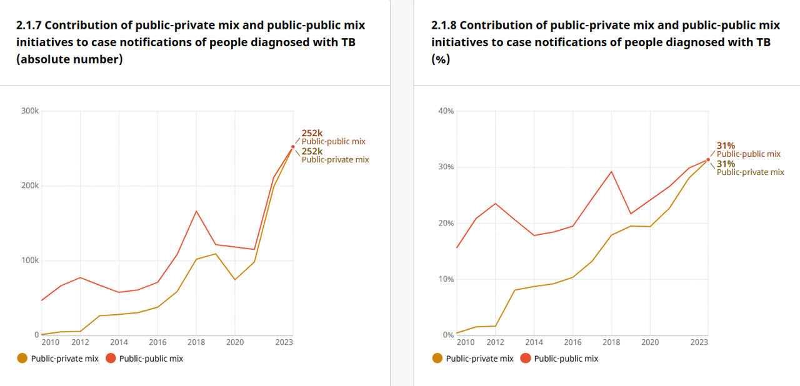

  
```{r setup, include=FALSE}

# Set chunk options.
# Results "asis" is needed to avoid xtable output being html encoded
# Suppress messages, warnings and also the ## at the beginning of printed text
# Set a default figure width too.

knitr::opts_chunk$set(echo = FALSE,
                      results = "asis",
                      message = FALSE,
                      warning = FALSE,
                      fig.width = 12)

# Load output packages ----
# - - - - - - - - - - - - - - - - - - - - - - - - - - - - - - - - - -
library(ggplot2)
library(ggrepel)
library(dplyr)
library(scales)
library(RColorBrewer)
# devtools::install_github("yamanakatakuya/whomapR")
# from https://github.com/yamanakatakuya/whomapR
library(whomapR)
library(gtbreport)
library(here)

library(jsonlite)
library(dplyr)
library(here)
library(kableExtra)

# Load R functions ----
# - - - - - - - - - - - - - - - - - - - - - - - - - - - - - - - - - -
source(here("report/functions/html_links.R"))
source(here("report/functions/output_ggplot.R"))

# Get the data sets and computed values/statistics ----
# - - - - - - - - - - - - - - - - - - - - - - - - - - - - - - - - - - - 
source(here('report/ch5-4_prepare_data.r'))

# Show static chart in addition to Kendo chart?
show_static = F

# Save underlying data files as CSV and charts as PDF files?
pdf_csv_folder = here::here("report/local/figures/ch5-4")
save_csv = TRUE
save_pdf = TRUE

# Create the output folder (only if it doesn't yet exist)
dir.create(pdf_csv_folder, showWarnings = FALSE, recursive = TRUE)

```


```{r css_js}
# Add standard stylesheets and javascript to support kendo
cat(writeLines(readLines(here("report/resources/headers.htm"))))
```


```{css, echo=FALSE}
/* MAF table */
/* Recreating simple striped bootstrap table */
#maf_table {
  border-spacing: 0;
  border-collapse: collapse;
  margin-top: 1em;
  margin-bottom: 1em;
  /* Next two lines to allow horizontal scrolling on narrow screens */
  display: block;
  overflow-x: auto;
}

#maf_table th {
  background-color: #ADD8E6;
  border-bottom: 2px solid #DDDDDD;
  padding: 8px;
}

#maf_table td {
  border-top: 1px solid #DDDDDD;
  padding: 8px;
}

/* Bold for the final row with thick line above */
#maf_table tr:last-child td {
  border-top: 2px solid #DDDDDD;
  font-weight:bold;	
  background-color: #FBE4D5;
}

#maf_table tr:first-child td {
  border-top: 2px solid #DDDDDD;
  font-weight:bold;	
  background-color: #D2F7FF;
}


/* light gray when hovering over a row */
#maf_table tr:hover td {
  background-color: #DDDDDD;
}

/* Centre-align all column headings except for the first */
#maf_table td:not(:first-child) {
  text-align: center !important;
}
#maf_table th:not(:first-child) {
  text-align: center !important;
}

/* prevent numbers from wrapping in any of the columns */
#maf_table td {
  white-space: nowrap;
}


```

# 5.4 The World Health Organization multisectoral accountability framework to end TB (MAF-TB) 
 
<span class="red">**Draft! Prepared `r Sys.Date()` using country-reported data snapshot files from `r format(as.Date(snapshot_date), format="%d %B %Y")`!**</span>  

Ending tuberculosis (TB) requires far more than health sector interventions alone – it demands decisive political commitment at the highest levels, robust collaboration across multiple sectors and a rigorous system of accountability (`r ref_lnk("1")`). Recognizing this, in the political declaration of the second United Nations (UN) high-level meeting on TB that was held in 2023 (`r ref_lnk("2")`), world leaders emphasized the need to strengthen multisectoral accountability for the TB response based on the World Health Organization (WHO) multisectoral accountability framework to end TB (MAF-TB) (`r ref_lnk("1")`).

This webpage highlights recent efforts to strengthen multisectoral accountability based on the MAF-TB and the current status of progress, first at global and then at national level. 

## Global level

WHO continues to lead global efforts to advance multisectoral engagement by spearheading global monitoring, reporting and accountability, while also providing critical technical support and guidance on the MAF-TB. These efforts form part of the WHO Director-General’s flagship initiative to end TB in the period 2023–2027 (`r ref_lnk("3")`).

In the past year, major activities have included convening of partners and MAF-TB promotion; a special report on TB among migrants and refugees; and a new global roadmap to strengthen the engagement of private and public health care providers in the TB response.

### Convening of partners and MAF-TB promotion

WHO continues to facilitate and convene a global multisectoral and multistakeholder platform. This brings together several UN agencies and other partners, with a focus on maintaining high-level political attention to multisectoral accountability in the TB response.

Key efforts since November 2024 have included: 

* <b>A WHO Global End TB Symposium.</b> This was part of the Union World Conference on Lung Health, held in November 2024. The importance of multisectoral accountability and the role of the MAF-TB was highlighted during the symposium, which was attended by more than 2000 people.

* <b>An interregional meeting.</b> In August 2025, a meeting on the MAF-TB was organized by the TB Europe Coalition and the Kenya Legal & Ethical Issues Network on HIV and AIDS, with support from WHO and UNITAID. The meeting brought together six countries: Kenya, Moldova, Nigeria, Tajikistan, Ukraine and Zimbabwe. It provided an opportunity to share country experience in using the MAF-TB and to develop concrete action plans to intensify MAF-TB implementation.

* <b>End TB youth townhalls and workshops.</b> WHO’s 1+1 Initiative is fostering the contribution of young people to global efforts to strengthen multisectoral accountability for the TB response. To date, more than 90 000 young people have been engaged through youth townhalls, workshops, other in-person events and social media campaigns. Examples include youth townhalls in Uganda and Madagascar in November and December 2024, respectively, and the launch of the 1+1 Initiative in the WHO South-East Asia Region in March 2025. Youth organizations that have been engaged include the International Federation of Medical Students’ Associations (IFMSA), the International Pharmaceutical Students’ Federation (IPSF), the International Student One Health Alliance (ISOHA) and the National Youth Movement Against TB (NYMAT).

### Special report on TB among migrants and refugees

WHO partnered with the Qatar Foundation and the World Innovation Summit for Health (WISH) to produce a landmark report on TB among migrants and refugees. This was launched at the WISH Forum in Doha, Qatar, in November 2024 (`r ref_lnk("4")`). The report highlighted how migration, displacement and TB are interrelated, and it called for bold and coordinated action.

WHO is working with the United Nations Refugee Agency (UNHCR) and the International Organization for Migration (IOM) to ensure that the topic of TB in refugees and migrants is given sustained attention, and that effective solutions are developed and implemented.

### Social protection

Social protection is a cornerstone of multisectoral action and accountability, and is essential for tackling the social determinants that drive the TB epidemic. In 2024, WHO issued guidance to help countries deliver on the 2023 UN high-level meeting commitment that, by 2027, every person with TB should have access to a comprehensive package of health and social benefits (`r ref_lnk("5")`). The latest data on social protection (<span class="red">Section 5.2</span>) show both progress and persistent gaps. Although social protection coverage has been gradually improving, only half of the world’s population is currently covered by at least one social protection benefit, with far lower levels of coverage in low- and middle-income countries where the TB burden is highest. A total of 98 countries are prioritizing collaboration with the social development sector as part of MAF-TB-related efforts to integrate social protection measures into their national TB responses.


### Global roadmap for public and private sector engagement and related dashboards

An updated global roadmap has been developed for efforts to strengthen engagement with the private sector and unengaged public sector health care providers through public–private mix (PPM) approaches (`r ref_lnk("6")`). In parallel, [PPM data dashboards](https://data.who.int/dashboards/tuberculosis/public-private-mix-for-tb) have been established in a new TB digital platform that is part of the World Health Data Hub (`r lnk("Box 5.4.1")`). 

### Country support

WHO continues to actively support countries to accelerate MAF-TB implementation; for example, by providing technical assistance for progress assessments, programme reviews, the development of comprehensive national strategic plans and the integration of robust MAF-TB components into these plans (e.g. legislative, regulatory and other critical measures). WHO is also driving efforts to facilitate national multisectoral consultations and establish mechanisms for multisectoral coordination and review (`r ref_lnk("1")`, `r ref_lnk("7")`).

<br />

## National level

Since 2020, WHO has been collecting data for priority MAF-TB-related indicators from all six WHO regions, as part of annual rounds of global TB data collection. These indicators relate to multisectoral reviews of progress in the TB response and associated key steps for action as outlined in the operational guidance; the production of an annual TB report, to inform high-level reviews; and engagement of different sectors of government. In 2025, additional data were requested about MAF-TB baseline assessments and the development of a related MAF-TB implementation plan.

In `r report_year`, `r ftb(t1_data$ms_review [t1_data$entity == "Global total"])` countries reported that they had multisectoral accountability and review mechanisms in place, including `r ftb(t1_data$ms_review [t1_data$entity == "High TB burden countries"])` of the 30 high TB burden countries (`r lnk("Table 5.4.1")`). A total of `r ftb(t1_data$ms_review_civil_soc[t1_data$entity == "Global total"])` countries, including `r ftb(t1_data$ms_review_civil_soc[t1_data$entity == "High TB burden countries"])` of the 30 high TB burden countries, reported that civil society and affected communities were represented in their multisectoral accountability and review mechanisms. In addition, `r ftb(t1_data$annual_report_published [t1_data$entity == "Global total"])` countries reported publishing an annual TB report on progress towards national TB-related targets and commitments; these `r ftb(t1_data$annual_report_published [t1_data$entity == "Global total"])` countries including `r ftb(t1_data$annual_report_published[t1_data$entity == "High TB burden countries"])` of the 30 high TB burden countries.

In `r report_year`, `r ftb(t1_txt_latest$maf_assessment)` countries reported that they had completed a MAF-TB baseline assessment, and `r ftb(t1_txt_latest$maf_implementation_plan)` countries reported that a MAF-TB implementation plan had been developed. A total of `r ftb(t1_txt_latest$all_five)` countries, including `r ftb(t1_data$all_five[t1_data$entity == "High TB burden countries"])` high TB burden countries, had all five core elements of the MAF-TB in place.


### `r anch("Table 5.4.1")`<span style="color:#F21905">Table 5.4.1</span> Status of core elements of multisectoral accountability for the 30 high TB burden countries, WHO regions and globally, `r report_year`

```{r echo=FALSE, message=FALSE, warning=FALSE, results = "asis", dev = 'png', table_1, fig.alt="MAF status",fig.height=18}

# Create a table object using kable
table_header <- linebreak(c('WHO regions, global total and high TB burden countries',
                  'Number of countries and areas',
                  'National multisectoral and multistakeholder accountability<br>and review mechanism, under high-level leadership',
                  'Engagement of civil society and affected communities in the multisectoral accountability and review mechanism',
                  'Annual national TB report publicly available',
                  'MAF-TB assessment conducted to inform planning and implementation',
                  'Development of MAF-TB implementation plan',
                  'All five core elements'
))

knitr::kable(t1_data_table,
             format = "html",
             col.names = table_header,
             align = 'lccccc',
             # Add a table ID so that it can be styled using extra CSS in Sitefinity
             table.attr = "id='maf_table'",escape = FALSE) 

```

<hr />
<br />


In `r report_year`, the sector that was most frequently reported as being engaged in the TB response was education; `r ftb(f1_txt$pct[f1_txt$variable == "Education"&f1_txt$category == 230])`% of countries reported that this sector was engaged in advocacy, information sharing, education and communication in the TB response (`r lnk("Fig. 5.4.1")`). 

Two sectors &#8211; defence (in `r ftb(f1_txt$pct[f1_txt$variable == "Defence"&f1_txt$category == 231])`% of countries globally) and justice (in `r ftb(f1_txt$pct[f1_txt$variable == "Justice"&f1_txt$category == 231])`% of countries globally) &#8211; were mostly engaged in TB prevention and care. In contrast, the social development sector (in `r ftb(f1_txt$pct[f1_txt$variable == "Social development"&f1_txt$category == 232])`% of countries globally) was mostly engaged in patient support, including the provision of economic, social or nutritional benefits. The data highlight the considerable scope to increase engagement across these key sectors and beyond (`r lnk("Fig. 5.4.1")`, `r lnk("Fig. 5.4.2")`).
  
### `r anch("Fig. 5.4.1")`<span style="color:#F21905">Fig. 5.4.1</span> Global percentage of countries with ministries (beyond health) engaged in the TB response in `r report_year` based on data reported by national TB programmes, for three topic areas

```{r fig_1, fig.alt="MAF global",fig.height=8}

f1_plot <- f1_data %>%
  
  mutate(category = factor(category, labels = c("Advocacy, information, education and communication", "TB prevention and care", "Patient support including economic, social or nutritional benefits"))) %>%
  
  ggplot(aes(category,
             pct,
             fill = category)) +
 
  geom_bar(stat = "identity") +
  facet_wrap( ~ variable, nrow = 3) +
  
  theme_gtb() +

  scale_fill_manual("", 
                    values = c("dodgerblue3","darkorange2","grey50")) +

  labs(x="", y="Percentage") +
  theme(
    axis.title.x = element_blank(),
    axis.text.x = element_blank())

output_ggplot(f1_plot, f1_data, show_static, pdf_csv_folder, save_csv, save_pdf)


```

<div class="row">
<div class="col-md-4">
<div id="fig_1_agr"></div>
</div>
<div class="col-md-4">
<div id="fig_1_def"></div>
</div>
<div class="col-md-4">
<div id="fig_1_edu"></div>
</div>
</div>

<div class="row">
<div class="col-md-4">
<div id="fig_1_fin"></div>
</div>
<div class="col-md-4">
<div id="fig_1_jus"></div>
</div>
<div class="col-md-4">
<div id="fig_1_lab"></div>
</div>
</div>

<div class="row">
<div class="col-md-4">
<div id="fig_1_soc"></div>
</div>
<div class="col-md-4">
<div id="fig_1_tra"></div>
</div>
</div>

<hr />
<br />
  

### `r anch("Fig. 5.4.2")`<span style="color:#F21905">Fig.5.4.2</span> Percentage of countries with ministries (beyond health) engaged in the TB response in `r report_year` based on data reported by national TB programmes, disaggregated by WHO region and for the 30 high TB burden countries

```{r fig_2, fig.alt="MAF region",fig.height=8}

f2_plot <- f2_data %>%
  
  mutate(entity = factor(entity, levels = c("Global","African Region","Region of the Americas",
                                            "South-East Asia Region","European Region",
                                            "Eastern Mediterranean Region","Western Pacific Region",
                                            "High TB burden countries"))) %>%
  
  ggplot(aes(variable,
             pct,
             fill = variable)) +
 
  geom_bar(stat = "identity") +
  facet_wrap( ~ entity, nrow = 3) +
  
  theme_gtb() +

  scale_fill_manual("", 
                    values = c("dodgerblue3","darkorange2","grey50","goldenrod3","dodgerblue4","limegreen","navy","sienna4")) +

  labs(x="", y="Percentage") +
  theme(
    axis.title.x = element_blank(),
    axis.text.x = element_blank())

output_ggplot(f2_plot, f2_data, show_static, pdf_csv_folder, save_csv, save_pdf)


```


<div class="row">
<div class="col-md-4">
<div id="fig_2_Global"></div>
</div>
<div class="col-md-4">
<div id="fig_2_AFR"></div>
</div>
<div class="col-md-4">
<div id="fig_2_AMR"></div>
</div>
</div>

<div class="row">
<div class="col-md-4">
<div id="fig_2_SEA"></div>
</div>
<div class="col-md-4">
<div id="fig_2_EUR"></div>
</div>
<div class="col-md-4">
<div id="fig_2_EMR"></div>
</div>
</div>

<div class="row">
<div class="col-md-4">
<div id="fig_2_WPR"></div>
</div>
<div class="col-md-4">
<div id="fig_2_HBC"></div>
</div>
</div>

<hr />
<br />


### National baseline assessments related to social protection

Since 2024, nine countries have conducted a baseline assessment specifically related to social protection: Cambodia, the Democratic Republic of the Congo, the Lao People’s Democratic Republic, Mongolia, Pakistan, the Philippines, South Africa, Uganda and Viet&nbsp;Nam. These countries have focused on the extent to which social protection programmes operating at national or subnational level are inclusive of people affected by TB and responsive to their needs (`r ref_lnk("7")`). Overall, these assessments have found that most social protection programmes in these countries are poorly accessible for people affected by TB, or are insufficient to meet their needs. Further information about social protection for people with TB is provided elsewhere in the report (<span class="red">Section 5.2</span>).

<hr />
<br />

<div class="textbox">
## `r anch("Box 5.4.1")` Box 5.4.1

## Strengthening public–private and public–public mix (data monitoring: development of World Health Data Hub data dashboards)

Private sector health care providers or unengaged public sector health care providers are often the first point of care for people with symptoms of TB; hence, these providers are important for multisectoral engagement efforts to end TB. To strengthen PPM monitoring, WHO has been working closely with national TB programmes, with the support of the Gates Foundation, to establish and scale up digital TB surveillance systems. Part of this effort has involved broadening the scope of indicators reported from private sector health care providers and unengaged public sector health care providers.

A major milestone has been the launch of enhanced interactive PPM data dashboards for seven priority countries: Bangladesh, India, Indonesia, Kenya, Nigeria, Pakistan and the Philippines. [The dashboards are now featured on WHO’s World Health Data Hub](https://data.who.int/dashboards/tuberculosis/public-private-mix-for-tb) (`r lnk("Fig. 5.4.3")`). The inclusion of these dashboards in the World Health Data Hub aims to increase the visibility of PPM contributions to TB care and prevention, while strengthening monitoring, accountability and service-quality tracking for better TB treatment outcomes.

A WHO policy brief captures lessons from this work, setting out key considerations for effective dashboard design and implementation (`r ref_lnk("8")`).

### `r anch("Fig. 5.4.3")`<span style="color:#F21905">Fig. 5.4.3</span> PPM contribution to case notifications of people diagnosed with TB, World Health Data Hub PPM dashboard for Indonesia

```{r fig_3,fig.alt="PPM contribution to case notifications of people diagnosed with TB, World Health Data Hub PPM dashboard for Indonesia", out.width = '80%'}



```


<div class="footnote">PPM: public–private mix.</div>

</div>

<hr style="border:1px solid gray20">                                                                                                                                                          
`r anch("refs")`

**References**

1. Multisectoral accountability framework to accelerate progress to end tuberculosis by 2030. Geneva: World Health Organization; 2019 (https://iris.who.int/handle/10665/331934). License: CC BY-NC-SA 3.0 IGO.

2. Resolution 78/5: Political declaration of the second high-level meeting of the General Assembly on the fight against tuberculosis. New York: United Nations General Assembly; 2023 (https://undocs.org/A/RES/78/5).

3. World Health Organization Director-General Flagship Initiative to #ENDTB 2023–2027 [website]. World Health Organization; 2023 (https://www.who.int/publications/m/item/who-director-general-flagship-initiative-to-endtb).

4.	Innovative solutions for the elimination of tuberculosis among migrants and refugees. Geneva: World Health Organization; 2024 (https://www.who.int/publications/m/item/innovative-solutions-for-the-elimination-of-tuberculosis-among-migrants-and-refugees). License: CC BY-NC-SA 3.0 IGO.

5.	World Health Organization, International Labour Organization. Guidance on social protection for people affected by tuberculosis. Geneva: World Health Organization; 2024 (https://iris.who.int/handle/10665/376542). License: CC BY-NC-SA 3.0 IGO.

6.	Public–private mix for TB prevention and care: a roadmap, 2nd ed. Geneva: World Health Organization; 2025 (in press).

7. WHO multisectoral accountability framework for TB (MAF-TB): baseline assessment checklist for country use in pursuing a national MAF-TB. Geneva: World Health Organization; 2020 (https://www.who.int/publications/m/item/who-multisectoral-accountability-framework-for-tb-(maf-tb)-baseline-assessment-checklist-for-country-use-in-pursuing-a-national-maf-tb).

8. Public–private mix data dashboards for enhanced action and accountability to end tuberculosis: policy brief. Geneva: World Health Organization; 2024 (https://iris.who.int/handle/10665/379262). License: CC BY-NC-SA 3.0 IGO.

  

```{r js_functions}
# Insert javascript file containing common Kendo number formatting functions ----
cat(writeLines(readLines(here("report/resources/gtbr_js.htm"))))
```


<script type="text/javascript">
/* JSON data objects for the figures */

var fig_1_data = `r f1_data %>% select(-n) %>% pivot_wider(names_from = category, values_from = pct) %>% rename("adv"=2, "tb"=3, "supp"=4) %>% mutate(cat="category") %>% toJSON("rows")`; 

var fig_2_data = `r f2_data %>% select(-n,-n_country) %>% pivot_wider(names_from = variable, values_from = pct) %>% rename("agr"=2, "def"=3, "dev"=4, "edu"=5, "fin"=6, "jus"=7, "lab"=8, "tra"=9) %>% mutate(cat="category") %>% toJSON("rows")`; 

</script>

```{js, echo=FALSE}
/* Functions to create the figures */

function createFig_1(fig_ID, data, filter) {

  	// Filter the dataset on the country variable
		dataJSON = data.filter( element => element.variable == filter);
  
		$(fig_ID).kendoChart({
			dataSource: dataJSON,
			chartArea: {
				height: 300
			},	
			title: {
				text: filter,
				color: "black",
				font: "bold 14px  Arial,Helvetica,sans-serif",
        align: "center"
			},	  

			legend: {
				position: "bottom",
				orientation: "vertical",
			},
			seriesDefaults: {
				type: "column"
			},
			series: [
			{name: "Advocacy, information, education and communication",
				field: "adv",
				color: "dodgerblue",
        tooltip: {
				visible: true,
				template: "Advocacy, information, education and communication: #= value.toPrecision(2) #%"
			}
			},{
        name:  "TB prevention and care",
				field: "tb",
				color: "darkorange",
        tooltip: {
				visible: true,
				template: "TB prevention and care: #= value.toPrecision(2) #%"
			}
			},{
        name:  "Patient support including economic, social or nutritional benefits",
				field: "supp",
				color: "grey",
        tooltip: {
				visible: true,
				template: "Patient support: #= value.toPrecision(2) #%"
			}
			},],
			valueAxis: {
				title: {
					text: "Percentage (%)"
				},
				line: {
					visible: false
				},
				max: 50,
				min: 0,
			},
			categoryAxis: {
				field: "cat",
				labels: {
					visible: false
				},
				majorGridLines: {
					visible: false
				},
				title: {
					text: ""
				}
			},
		});
}


function createFig_2(fig_ID, data, filter) {

  	// Filter the dataset on the country variable
		dataJSON = data.filter( element => element.entity == filter);
  
		$(fig_ID).kendoChart({
			dataSource: dataJSON,
			chartArea: {
				height: 300
			},	
			title: {
				text: filter,
				color: "black",
				font: "bold 14px  Arial,Helvetica,sans-serif",
        align: "center"
			},	  

			legend: {
				position: "bottom",
			},
			seriesDefaults: {
				type: "column"
			},
			series: [
			{name: "Agriculture",
				field: "agr",
				color: "dodgerblue",
        tooltip: {
				visible: true,
				template: "Agriculture: #= value.toPrecision(2) #%"
			}
			},{
        name:  "Defence",
				field: "def",
				color: "darkorange",
        tooltip: {
				visible: true,
				template: "Defence: #= value.toPrecision(2) #%"
			}
			},{
        name:  "Education",
				field: "edu",
				color: "grey",
        tooltip: {
				visible: true,
				template: "Education: #= value.toPrecision(2) #%"
			}
			},{
        name:  "Finance",
				field: "fin",
				color: "goldenrod",
        tooltip: {
				visible: true,
				template: "Finance: #= value.toPrecision(2) #%"
			}
			},{
        name:  "Justice",
				field: "jus",
				color: "#104E8B",
        tooltip: {
				visible: true,
				template: "Justice: #= value.toPrecision(2) #%"
			}
			},{
        name:  "Labour",
				field: "lab",
				color: "limegreen",
        tooltip: {
				visible: true,
				template: "Labour: #= value.toPrecision(2) #%"
			}
			},{
        name:  "Social development",
				field: "dev",
				color: "navy",
        tooltip: {
				visible: true,
				template: "Social development: #= value.toPrecision(2) #%"
			}
			},{
        name:  "Transport",
				field: "tra",
				color: "#8B4726",
        tooltip: {
				visible: true,
				template: "Transport: #= value.toPrecision(2) #%"
			}
			},],
			valueAxis: {
				title: {
					text: "Percentage (%)"
				},
				line: {
					visible: false
				},
				max: 100,
				min: 0,
			},
			categoryAxis: {
				field: "cat",
				labels: {
					visible: false
				},
				majorGridLines: {
					visible: false
				},
				title: {
					text: ""
				}
			},
		});
}


```


```{js, echo=FALSE}
/* Create the figures after the document has been loaded */

$(document).ready(function () {
                  <!-- createFig_1("#fig_1",fig_1_data); -->
                  
                  createFig_1("#fig_1_agr",fig_1_data,"Agriculture");
                  createFig_1("#fig_1_def",fig_1_data,"Defence");
                  createFig_1("#fig_1_edu",fig_1_data,"Education");
                  createFig_1("#fig_1_fin",fig_1_data,"Finance");
                  createFig_1("#fig_1_jus",fig_1_data,"Justice");
                  createFig_1("#fig_1_lab",fig_1_data,"Labour");
                  createFig_1("#fig_1_soc",fig_1_data,"Social development");
                  createFig_1("#fig_1_tra",fig_1_data,"Transport");
                  
                  createFig_2("#fig_2_Global",fig_2_data,"Global");
                  createFig_2("#fig_2_AFR",fig_2_data,"African Region");
                  createFig_2("#fig_2_AMR",fig_2_data,"Region of the Americas");
                  createFig_2("#fig_2_SEA",fig_2_data,"South-East Asia Region");
                  createFig_2("#fig_2_EUR",fig_2_data,"European Region");
                  createFig_2("#fig_2_EMR",fig_2_data,"Eastern Mediterranean Region");
                  createFig_2("#fig_2_WPR",fig_2_data,"Western Pacific Region");
                  createFig_2("#fig_2_HBC",fig_2_data,"High TB burden countries");


}); 

```
